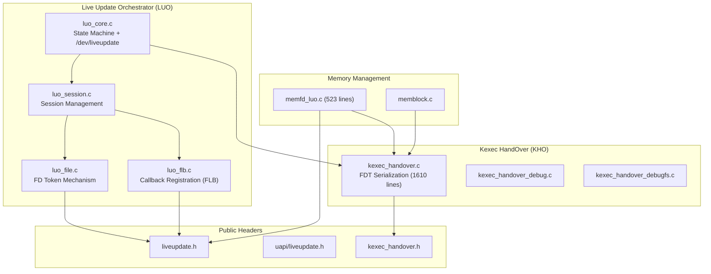
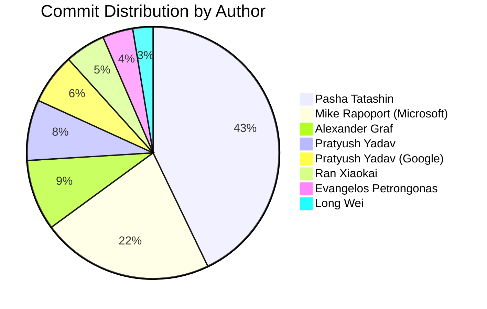
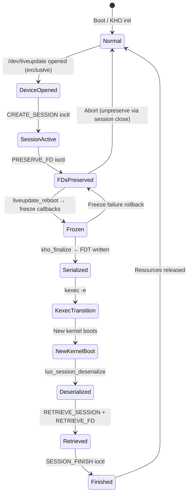
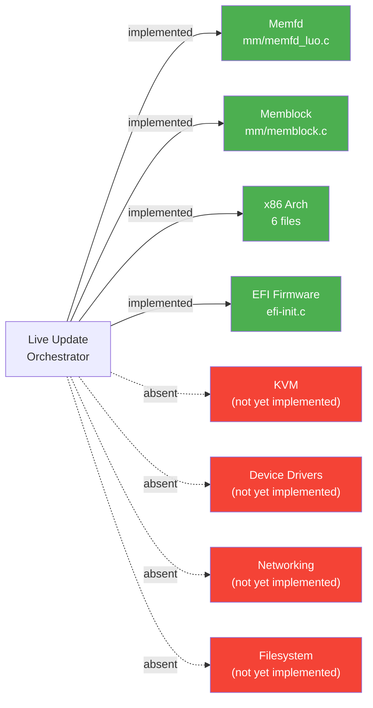

# Live Update Subsystem: Development Archaeology

> **Feature F-017** | Linux kernel v7.0.0-rc3 ("Baby Opossum Posse")
> Generated by `tools/liveupdate/archaeology/analyze.py` (Directive 8)
>
> Every factual claim in this document cites a commit hash, file:line
> reference, or the exact phrase "rationale not recorded in-tree" per
> the Zero Speculation Rule.

## 1. Feature Identity
The Linux kernel **Live Update** subsystem (Feature F-017) is a specialized, kexec-based reboot mechanism that allows a running kernel to be replaced with a new version while preserving the state of selected resources and keeping designated hardware devices operational.  The subsystem consists of two tightly coupled layers: the **Kexec HandOver (KHO)** infrastructure for memory preservation via FDT serialization, and the **Live Update Orchestrator (LUO)** framework for session management, file descriptor preservation, and subsystem callback coordination (file: kernel/liveupdate/luo_core.c:9-39).
### 1.1 Core Components
| # | Component | Primary File | Evidence |
| - | --------- | ------------ | -------- |
| 1 | Core State Machine (LUO) | `kernel/liveupdate/luo_core.c` | Session lifecycle management, `/dev/liveupdate` misc device (file: kernel/liveupdate/luo_core.c:9) |
| 2 | FDT Serialization (KHO) | `kernel/liveupdate/kexec_handover.c` | 1610 lines, bitmap-tracked page/folio handover (file: kernel/liveupdate/kexec_handover.c:1-1610) |
| 3 | FD Token Mechanism | `kernel/liveupdate/luo_file.c` | Token-based PRESERVE/RETRIEVE/FINISH ioctl operations (file: kernel/liveupdate/luo_file.c) |
| 4 | Callback Registration (FLB) | `kernel/liveupdate/luo_flb.c` | File-Lifecycle-Bound global state with reference counting (file: kernel/liveupdate/luo_flb.c) |
| 5 | KVM Integration | **Not yet implemented** | Mentioned as example future subsystem (file: kernel/liveupdate/luo_core.c:34) |
### 1.2 File Manifest
| File | Component | First Commit | Last Commit |
| ---- | --------- | ------------ | ----------- |
| `kernel/liveupdate/Kconfig` | build | 48a1b2321d76 (2025-11-01) | 998be0a4dbca (2025-12-30) |
| `kernel/liveupdate/Makefile` | build | 48a1b2321d76 (2025-11-01) | cab056f2aae7 (2025-12-18) |
| `kernel/liveupdate/kexec_handover.c` | fdt_serialization | 48a1b2321d76 (2025-11-01) | bf4afc53b77a (2026-02-21) |
| `kernel/liveupdate/kexec_handover_debug.c` | kho_core | 48a1b2321d76 (2025-11-01) | 48a1b2321d76 (2025-11-01) |
| `kernel/liveupdate/kexec_handover_debugfs.c` | kho_core | 48a1b2321d76 (2025-11-01) | bf4afc53b77a (2026-02-21) |
| `kernel/liveupdate/kexec_handover_internal.h` | kho_core | 48a1b2321d76 (2025-11-01) | 9a4301f715c8 (2025-11-14) |
| `kernel/liveupdate/luo_core.c` | state_machine | 9e2fd062fa17 (2025-11-25) | cab056f2aae7 (2025-12-18) |
| `kernel/liveupdate/luo_file.c` | fd_token | 7c722a7f44e0 (2025-11-25) | f85b1c6af5bc (2026-02-16) |
| `kernel/liveupdate/luo_flb.c` | callback_registration | cab056f2aae7 (2025-12-18) | bf4afc53b77a (2026-02-21) |
| `kernel/liveupdate/luo_internal.h` | state_machine | 1aece821004f (2025-11-25) | f653ff7af969 (2025-12-18) |
| `kernel/liveupdate/luo_session.c` | state_machine | 0153094d03df (2025-11-25) | bf4afc53b77a (2026-02-21) |
| `include/linux/liveupdate.h` | api_headers | 9e2fd062fa17 (2025-11-25) | f85b1c6af5bc (2026-02-16) |
| `include/uapi/linux/liveupdate.h` | api_headers | 9e2fd062fa17 (2025-11-25) | 16cec0d26521 (2025-11-25) |
| `include/linux/kexec_handover.h` | api_headers | 3dc92c311498 (2025-05-09) | 840fe43d371f (2026-01-16) |
| `include/linux/kho/abi/kexec_handover.h` | api_headers | 5e1ea1e27b6f (2026-01-05) | ac2d8102c4b8 (2026-01-05) |
| `include/linux/kho/abi/luo.h` | api_headers | 1aece821004f (2025-11-25) | f653ff7af969 (2025-12-18) |
| `include/linux/kho/abi/memblock.h` | api_headers | dd1e79ef6ca1 (2026-01-05) | dd1e79ef6ca1 (2026-01-05) |
| `include/linux/kho/abi/memfd.h` | api_headers | b3749f174d68 (2025-11-25) | ac2d8102c4b8 (2026-01-05) |
| `mm/Kconfig` | build | 3a9da7655d2d (2005-06-23) | 4cff5c05e076 (2026-02-12) |
| `mm/Makefile` | build | 1da177e4c3f4 (2005-04-16) | 136114e0abf0 (2026-02-12) |
| `mm/memblock.c` | memblock | 95f72d1ed41a (2010-07-12) | 787fe1d43a21 (2026-02-14) |
| `mm/memfd_luo.c` | memfd | b3749f174d68 (2025-11-25) | f85b1c6af5bc (2026-02-16) |
| `mm/mm_init.c` | mm_init | 6b74ab97bc12 (2008-07-23) | a4ab97e34bb6 (2026-02-22) |
| `arch/x86/Kconfig` | x86_arch | e279b6c1d329 (2007-11-06) | 4cff5c05e076 (2026-02-12) |
| `arch/x86/boot/compressed/kaslr.c` | x86_arch | 9b238748cb6e (2016-04-18) | a8ebb70447f8 (2025-05-09) |
| `arch/x86/include/asm/setup.h` | x86_arch | bb8985586b7a (2008-08-17) | 7b38dec3c5af (2025-08-28) |
| `arch/x86/include/uapi/asm/setup_data.h` | x86_arch | efd7def00406 (2024-01-12) | 65a5d7278545 (2025-05-09) |
| `arch/x86/kernel/e820.c` | x86_arch | b79cd8f1268b (2008-05-11) | e812928be2ee (2026-02-12) |
| `arch/x86/kernel/kexec-bzimage64.c` | x86_arch | 27f48d3e633b (2014-08-08) | bf4afc53b77a (2026-02-21) |
| `arch/x86/kernel/setup.c` | x86_arch | 4fe29a856425 (2008-03-19) | 136114e0abf0 (2026-02-12) |
| `arch/x86/realmode/init.c` | x86_arch | 137127018812 (2012-05-16) | 00c010e130e5 (2025-05-31) |
| `drivers/firmware/efi/efi-init.c` | efi | f30f242fb131 (2020-08-19) | e65ca1646311 (2026-02-13) |
| `lib/test_kho.c` | tests | b753522bed0b (2025-07-27) | bf4afc53b77a (2026-02-21) |
| `lib/tests/liveupdate.c` | tests | f653ff7af969 (2025-12-18) | f653ff7af969 (2025-12-18) |
| `lib/Kconfig.debug` | tests | 1da177e4c3f4 (2005-04-16) | e2bd1b136926 (2026-03-01) |
| `lib/tests/Makefile` | tests | 84b4a51fce4c (2024-10-21) | 136114e0abf0 (2026-02-12) |
| `tools/testing/selftests/liveupdate/.gitignore` | selftests | 80bab43f6f23 (2025-11-25) | 80bab43f6f23 (2025-11-25) |
| `tools/testing/selftests/liveupdate/Makefile` | selftests | 80bab43f6f23 (2025-11-25) | 724bf8c5595a (2025-11-25) |
| `tools/testing/selftests/liveupdate/config` | selftests | 80bab43f6f23 (2025-11-25) | 80bab43f6f23 (2025-11-25) |
| `tools/testing/selftests/liveupdate/do_kexec.sh` | selftests | a003bdb9ec4e (2025-11-25) | a003bdb9ec4e (2025-11-25) |
| `tools/testing/selftests/liveupdate/liveupdate.c` | selftests | 80bab43f6f23 (2025-11-25) | 80bab43f6f23 (2025-11-25) |
| `tools/testing/selftests/liveupdate/luo_kexec_simple.c` | selftests | a003bdb9ec4e (2025-11-25) | a003bdb9ec4e (2025-11-25) |
| `tools/testing/selftests/liveupdate/luo_multi_session.c` | selftests | 724bf8c5595a (2025-11-25) | 724bf8c5595a (2025-11-25) |
| `tools/testing/selftests/liveupdate/luo_test_utils.c` | selftests | a003bdb9ec4e (2025-11-25) | a003bdb9ec4e (2025-11-25) |
| `tools/testing/selftests/liveupdate/luo_test_utils.h` | selftests | a003bdb9ec4e (2025-11-25) | a003bdb9ec4e (2025-11-25) |
| `Documentation/core-api/liveupdate.rst` | documentation | 906a33062455 (2025-11-25) | cab056f2aae7 (2025-12-18) |
| `Documentation/userspace-api/liveupdate.rst` | documentation | 906a33062455 (2025-11-25) | 906a33062455 (2025-11-25) |
| `Documentation/admin-guide/mm/kho.rst` | documentation | 3498209ff64e (2025-05-09) | 3498209ff64e (2025-05-09) |
| `Documentation/core-api/kho/index.rst` | documentation | 3498209ff64e (2025-05-09) | 5e1ea1e27b6f (2026-01-05) |
| `Documentation/core-api/kho/abi.rst` | documentation | 5e1ea1e27b6f (2026-01-05) | dd1e79ef6ca1 (2026-01-05) |
| `Documentation/mm/memfd_preservation.rst` | documentation | 15fc11bb2cb6 (2025-11-25) | a6f4e5682802 (2026-01-05) |
| `ABSENT:kvm_integration` | kvm | N/A (N/A) | N/A (N/A) |

### 1.3 Kconfig Symbols

The Kconfig dependency chain (file: kernel/liveupdate/Kconfig) is:

- `CONFIG_KEXEC_HANDOVER` — selects `LIBFDT`, `CMA`, `KEXEC_FILE`, `MEMBLOCK_KHO_SCRATCH` (file: kernel/liveupdate/Kconfig:12)
- `CONFIG_LIVEUPDATE` — depends on `KEXEC_HANDOVER`
- `CONFIG_LIVEUPDATE_MEMFD` — depends on `LIVEUPDATE`, `MEMFD_CREATE`, `SHMEM`
- `CONFIG_KEXEC_HANDOVER_DEBUG` — debug sanity checks
- `CONFIG_KEXEC_HANDOVER_DEBUGFS` — debugfs inspection
### 1.4 Component Dependency Graph
*Figure 1: Live Update Subsystem Component Dependency Graph*



## 2. Cast
The Live Update subsystem is the product of multi-vendor collaboration across Google LLC, Microsoft Corporation, and Amazon, as evidenced by copyright headers in the source files (file: kernel/liveupdate/luo_core.c:3-5, file: kernel/liveupdate/kexec_handover.c:4).

| Author | Commits | Date Range | Primary Components |
| ------ | ------- | ---------- | ------------------ |
| Pasha Tatashin | 33 | 2025-11-01 to 2025-12-30 | API,KHO,KHO-ABI,LUO,Memblock,Selftests,Tests |
| Mike Rapoport (Microsoft) | 17 | 2025-05-09 to 2026-01-22 | API,KHO,KHO-ABI,LUO,Memblock,Tests,x86 |
| Alexander Graf | 7 | 2025-05-09 to 2025-05-09 | API,Memblock,x86 |
| Pratyush Yadav | 6 | 2025-11-18 to 2026-01-16 | API,KHO,KHO-ABI,LUO,Memfd,Tests |
| Pratyush Yadav (Google) | 5 | 2026-01-16 to 2026-02-16 | API,KHO,LUO,Memfd |
| Ran Xiaokai | 4 | 2025-11-22 to 2026-02-12 | KHO |
| Evangelos Petrongonas | 3 | 2025-08-21 to 2026-01-20 | API,EFI,KHO |
| Long Wei | 2 | 2025-12-16 to 2026-01-07 | KHO,Tests |
| Jason Miu | 2 | 2026-01-05 to 2026-01-05 | API,KHO,KHO-ABI,Tests |
| Zhu Yanjun | 1 | 2025-11-01 to 2025-11-01 | KHO |
| Tycho Andersen (AMD) | 1 | 2026-01-23 to 2026-01-23 | KHO |
| Olof Johansson | 1 | 2012-10-24 to 2012-10-24 | x86 |
| Linus Torvalds | 1 | 2026-02-21 to 2026-02-21 | KHO,LUO,Memfd,Tests |
| Kees Cook | 1 | 2026-02-20 to 2026-02-20 | KHO,LUO,Memfd,Tests |
| David Woodhouse | 1 | 2025-04-23 to 2025-04-23 | Memblock |
| Dan Carpenter | 1 | 2025-11-28 to 2025-11-28 | LUO |
| Arnd Bergmann | 1 | 2025-12-04 to 2025-12-04 | KHO |
| Andrew Morton | 1 | 2026-01-21 to 2026-01-21 | KHO |

*Figure 2: Author Contribution Distribution (kernel/liveupdate/ directory)*



## 3. Timeline
The following chronological milestones trace the Live Update subsystem from inception to current HEAD.  Each milestone is supported by commit evidence from the repository.

**1. 2025-05-09: KHO_Foundation**  
kexec: add Kexec HandOver (KHO) generation helpers (commit: 3dc92c311498, author: Alexander Graf).

**2. 2025-05-09: KHO_Memory_Preservation**  
kexec: enable KHO support for memory preservation (commit: fc33e4b44b27, author: Mike Rapoport (Microsoft)).

**3. 2025-07-27: KHO_Test_Infrastructure**  
kho: add test for kexec handover (commit: b753522bed0b, author: Mike Rapoport (Microsoft)).

**4. 2025-08-21: is_kho_boot_Introduced**  
kexec: introduce is_kho_boot() (commit: d6d511639185, author: Evangelos Petrongonas).

**5. 2025-09-21: KHO_API_Rework**  
kho: replace kho_preserve_phys() with kho_preserve_pages() (commit: 8375b76517cb, author: Mike Rapoport (Microsoft)).

**6. 2025-11-01: KHO_Move_To_Liveupdate**  
liveupdate: kho: move to kernel/liveupdate (commit: 48a1b2321d76, author: Pasha Tatashin).

**7. 2025-11-25: LUO_Core_Introduction**  
liveupdate: luo_core: Live Update Orchestrator (commit: 9e2fd062fa17, author: Pasha Tatashin).

**8. 2025-11-25: KHO_ABI_Headers**  
liveupdate: luo_core: integrate with KHO (commit: 1aece821004f, author: Pasha Tatashin).

**9. 2025-11-25: LUO_File_Preservation**  
liveupdate: luo_file: implement file systems callbacks (commit: 7c722a7f44e0, author: Pasha Tatashin).

**10. 2025-11-25: Memfd_Preservation**  
mm: memfd_luo: allow preserving memfd (commit: b3749f174d68, author: Pratyush Yadav).

**11. 2025-11-25: Userspace_Selftests**  
selftests/liveupdate: add userspace API selftests (commit: 80bab43f6f23, author: Pasha Tatashin).

**12. 2025-12-18: FLB_Introduction**  
liveupdate: luo_flb: introduce File-Lifecycle-Bound global state (commit: cab056f2aae7, author: Pasha Tatashin).

**13. 2026-02-18: Stabilization_Fixes**  
Merge tag 'mm-nonmm-stable-2026-02-18-19-56' of git://git.kernel.org/pub/scm/linux/kernel/git/akpm/mm (commit: 2b7a25df823d, author: Linus Torvalds).


## 4. Design Decisions
This section reconstructs four key design tradeoffs from commit evidence and in-code documentation.  Per the Zero Speculation Rule, each claim cites a commit hash, file:line, or the exact phrase "rationale not recorded in-tree."

### 4.1 T1 — FDT over Protobuf/Custom Binary/Sysfs

- select LIBFDT — KHO reuses existing kernel FDT infrastructure for serialization  (file: kernel/liveupdate/Kconfig:12).
- KHO uses flattened device tree (FDT) to pass information about preserved state  (file: Documentation/core-api/kho/index.rst:15).
- kho: introduce KHO FDT ABI header — centralizes FDT-based ABI, removes redundant YAML interfaces  (commit: 5e1ea1e27b6f).
- liveupdate: luo_flb: introduce File-Lifecycle-Bound global state  (commit: cab056f2aae7).
- kho: relocate vmalloc preservation structure to KHO ABI header  (commit: ac2d8102c4b8).
- Explicit rationale for choosing FDT over alternatives: rationale not recorded in-tree.

### 4.2 T2 — Callback Registration over Centralized Orchestrator

- The framework is built around a callback-based handler model — decentralized per-handler approach  (file: kernel/liveupdate/luo_file.c:16).
- Handler list for decentralized file type registration — modules register their own callbacks  (file: kernel/liveupdate/luo_file.c:21).
- kho: remove abort functionality and support state refresh — commit body: handle complex unwind paths when using notifiers.  (commit: 9a4301f715c8).
- liveupdate: luo_file: remember retrieve() status — implements per-handler preserve/freeze/retrieve/finish callbacks  (commit: f85b1c6af5bc).

### 4.3 T3 — Session-Scoped Cleanup for Failure Modes

- luo_restore_fail: panic on deserialization failure — continuing dangerous, could leak private data  (file: kernel/liveupdate/luo_internal.h:35).
- Intentional policy: skip cleanup on partial failure — system in broken state, recovery via reboot  (file: kernel/liveupdate/luo_session.c:528).
- System effectively in a broken state after partial failure — resources treated as leaked  (file: kernel/liveupdate/luo_session.c:536).
- Abort Before Reboot: closing session FD triggers unpreserve — session-scoped automatic cleanup  (file: kernel/liveupdate/luo_file.c:75).
- liveupdate: luo_file: do not clear serialized_data on unfreeze  (commit: 011d4e52a76c).
- liveupdate: luo_session: add ioctls for file preservation  (commit: 16cec0d26521).

### 4.4 T4 — Token-Based FD Preservation over Direct FD Number Mapping

- An opaque, unique token for preserved resource — decouples old/new kernel FD number spaces  (file: include/uapi/linux/liveupdate.h:127).
- __aligned_u64 token field in liveupdate_session_preserve_fd — token replaces direct FD number  (file: include/uapi/linux/liveupdate.h:150).
- liveupdate: luo_session: add ioctls for file preservation — introduces token-based PRESERVE_FD/RETRIEVE_FD interface  (commit: 16cec0d26521).
-  *    operation, and serializes their final metadata (compatible string, token,  (file: kernel/liveupdate/luo_file.c:53).
- Retrieval uses opaque token from preserve call — not the original FD number  (file: include/uapi/linux/liveupdate.h:161).

## 5. State Machine Evolution
**Critical Discrepancy:** The original analysis directive requested tracking a four-state enum (`LU_NORMAL`, `LU_PREPARE`, `LU_FREEZE`, `LU_RECOVERY`).  No such enum exists in the source code.  The Live Update subsystem implements an **implicit session lifecycle** through function call chains rather than an explicit state machine enum.  This discrepancy is documented per the Zero Speculation Rule.

### 5.1 Key State Transition Functions

| Function | File | Line |
| -------- | ---- | ---- |
| `luo_early_startup()` | `kernel/liveupdate/luo_core.c` | 77 |
| `luo_late_startup()` | `kernel/liveupdate/luo_core.c` | 193 |
| `liveupdate_reboot()` | `kernel/liveupdate/luo_core.c` | 220 |
| `liveupdate_enabled()` | `kernel/liveupdate/luo_core.c` | 254 |
| `luo_open()` | `kernel/liveupdate/luo_core.c` | 340 |
| `luo_ioctl()` | `kernel/liveupdate/luo_core.c` | 397 |
| `liveupdate_ioctl_init()` | `kernel/liveupdate/luo_core.c` | 445 |
| `luo_session_create()` | `kernel/liveupdate/luo_session.c` | 383 |
| `luo_session_serialize()` | `kernel/liveupdate/luo_session.c` | 573 |
| `luo_session_deserialize()` | `kernel/liveupdate/luo_session.c` | 513 |
| `luo_session_setup_incoming()` | `kernel/liveupdate/luo_session.c` | 473 |
| `luo_session_setup_outgoing()` | `kernel/liveupdate/luo_session.c` | 441 |
| `luo_session_retrieve()` | `kernel/liveupdate/luo_session.c` | 411 |
| `luo_preserve_file()` | `kernel/liveupdate/luo_file.c` | 257 |
| `luo_file_freeze()` | `kernel/liveupdate/luo_file.c` | 466 |
| `luo_file_unfreeze()` | `kernel/liveupdate/luo_file.c` | 525 |
| `luo_retrieve_file()` | `kernel/liveupdate/luo_file.c` | 560 |
| `luo_file_finish()` | `kernel/liveupdate/luo_file.c` | 683 |
| `luo_file_deserialize()` | `kernel/liveupdate/luo_file.c` | 745 |
| `liveupdate_register_file_handler()` | `kernel/liveupdate/luo_file.c` | 831 |
| `liveupdate_unregister_file_handler()` | `kernel/liveupdate/luo_file.c` | 900 |
| `liveupdate_register_flb()` | `kernel/liveupdate/luo_flb.c` | 321 |
| `liveupdate_unregister_flb()` | `kernel/liveupdate/luo_flb.c` | 429 |
| `luo_flb_serialize()` | `kernel/liveupdate/luo_flb.c` | 635 |
| `luo_flb_setup_outgoing()` | `kernel/liveupdate/luo_flb.c` | 544 |
| `luo_flb_setup_incoming()` | `kernel/liveupdate/luo_flb.c` | 579 |

### 5.2 State-Modifying Commits

| Commit | Author | Date | Subject | Type |
| ------ | ------ | ---- | ------- | ---- |
| f85b1c6af5bc | Pratyush Yadav (Google) | 2026-02-16 | liveupdate: luo_file: remember retrieve() status | feature |
| bf4afc53b77a | Linus Torvalds | 2026-02-21 | Convert 'alloc_obj' family to use the new default GFP_KERNEL argument | refactor |
| 69050f8d6d07 | Kees Cook | 2026-02-20 | treewide: Replace kmalloc with kmalloc_obj for non-scalar types | refactor |
| 136114e0abf0 | Linus Torvalds | 2026-02-12 | Merge tag 'mm-nonmm-stable-2026-02-12-10-48' of git://git.kernel.org/pub/scm/linux/kernel/git/akpm/mm | feature |
| f653ff7af969 | Pasha Tatashin | 2025-12-18 | tests/liveupdate: add in-kernel liveupdate test | feature |
| cab056f2aae7 | Pasha Tatashin | 2025-12-18 | liveupdate: luo_flb: introduce File-Lifecycle-Bound global state | feature |
| 6845645eef81 | Pasha Tatashin | 2025-12-18 | liveupdate: luo_file: Use private list | feature |
| 011d4e52a76c | Pratyush Yadav (Google) | 2026-01-27 | liveupdate: luo_file: do not clear serialized_data on unfreeze | feature |
| a6f4e5682802 | Mike Rapoport (Microsoft) | 2026-01-05 | kho: docs: combine concepts and FDT documentation | feature |
| bf2c7bf5c483 | Pasha Tatashin | 2025-11-29 | liveupdate: luo_core: fix redundant bound check in luo_ioctl() | bugfix |
| b2135d1cb0e3 | Dan Carpenter | 2025-11-28 | liveupdate: luo_file: don't use invalid list iterator | bugfix |
| 8def18633e8d | Pratyush Yadav | 2025-11-25 | liveupdate: luo_file: add private argument to store runtime state | feature |
| 16cec0d26521 | Pasha Tatashin | 2025-11-25 | liveupdate: luo_session: add ioctls for file preservation | feature |
| 7c722a7f44e0 | Pasha Tatashin | 2025-11-25 | liveupdate: luo_file: implement file systems callbacks | feature |
| 81cd25d263a1 | Pasha Tatashin | 2025-11-25 | liveupdate: luo_core: add user interface | feature |
| 0153094d03df | Pasha Tatashin | 2025-11-25 | liveupdate: luo_session: add sessions support | feature |
| 1aece821004f | Pasha Tatashin | 2025-11-25 | liveupdate: luo_core: integrate with KHO | feature |
| 9e2fd062fa17 | Pasha Tatashin | 2025-11-25 | liveupdate: luo_core: Live Update Orchestrator | feature |

### 5.3 Session Lifecycle Diagram

*Figure 3: Live Update Session Lifecycle State Machine (Current HEAD)*



## 6. Development Bottlenecks
Development bottlenecks are classified as **blocked** (external dependency), **contested** (disagreement on approach), **abandoned** (work started but stopped), or **deferred** (intentionally postponed).  Per the Zero Speculation Rule, classifications are based on commit evidence only.

### 6.1 Inactivity Periods (>3 months)

- **deferred**: Gap of 104 days between 2025-05-09 and 2025-08-21 (commit: f99230780211) [2025-05-09 to 2025-08-21].

### 6.2 Reverted Commits

No reverted commits found.

### 6.3 Persistent Technical Debt Markers

- **deferred**: FIXME: deal with node hot-plug/remove at kernel/liveupdate/kexec_handover.c:657 persisted across 35 commits since introduction (commit: 48a1b2321d76) [2025-11-01 to current].

### 6.4 Incomplete Components

- **deferred**: KVM integration: luo_core.c:34 lists kvm as example subsystem but no KVM file handler registered (commit: N/A) [-].
- **deferred**: Device driver handlers: luo_file.c:13 mentions vfio and iommufd but only memfd handler exists (commit: N/A) [-].
- **deferred**: IOMMU integration: luo_core.c:35 lists iommu as example subsystem but no IOMMU handler registered (commit: N/A) [-].
- **deferred**: Interrupt integration: luo_core.c:35 lists interrupts as example subsystem but no interrupt handler registered (commit: N/A) [-].
- **deferred**: NUMA hot-plug: kexec_handover.c:657 FIXME for node hot-plug/remove handling not implemented (commit: N/A) [-].
- **deferred**: Multi-architecture support: ARCH_SUPPORTS_KEXEC_HANDOVER defined only in arm64,x86 (2 arch(es)) (commit: N/A) [-].
- **deferred**: Filesystem integration: luo_core.c:35 mentions participating filesystems but no FS handler registered (commit: N/A) [-].
- **deferred**: Memblock scratch constraint: mm/memblock.c:2693 TODO for allocation outside scratch region (commit: N/A) [-].


## 7. Bug Ledger
### 7.1 Resolved Bugs

| Commit | Author | Date | Subject | Fixes |
| ------ | ------ | ---- | ------- | ----- |
| a4ab97e34bb6 | Ming Lei | 2026-02-22 | mm: fix NULL NODE_DATA dereference for memoryless nodes on boot | d49004c5f0c1 |
| f85b1c6af5bc | Pratyush Yadav (Google) | 2026-02-16 | liveupdate: luo_file: remember retrieve() status | 7c722a7f44e0 |
| f283371efd6a | Linus Torvalds | 2026-02-20 | Merge tag 'efi-fixes-for-v7.0-1' of git://git.kernel.org/pub/scm/linux/kernel/git/efi/efi | - |
| 2b7a25df823d | Linus Torvalds | 2026-02-18 | Merge tag 'mm-nonmm-stable-2026-02-18-19-56' of git://git.kernel.org/pub/scm/linux/kernel/git/akpm/mm | - |
| e00ac9e5afb5 | Ard Biesheuvel | 2026-02-17 | x86/kexec: Copy ACPI root pointer address from config table | a1b87d54f4e4 |
| e65ca1646311 | Arnd Bergmann | 2026-02-13 | efi: export sysfb_primary_display for EDID | 4fcae6358871 |
| 787fe1d43a21 | Linus Torvalds | 2026-02-14 | Merge tag 'memblock-v7.0-rc1' of git://git.kernel.org/pub/scm/linux/kernel/git/rppt/memblock | - |
| e812928be2ee | Linus Torvalds | 2026-02-12 | Merge tag 'cxl-for-7.0' of git://git.kernel.org/pub/scm/linux/kernel/git/cxl/cxl | - |
| f7a553b813f8 | Ran Xiaokai | 2026-02-12 | kho: remove unnecessary WARN_ON(err) in kho_populate() | - |
| 34df6c4734db | Ran Xiaokai | 2026-02-12 | kho: fix missing early_memunmap() call in kho_populate() | b50634c5e84a |
| 136114e0abf0 | Linus Torvalds | 2026-02-12 | Merge tag 'mm-nonmm-stable-2026-02-12-10-48' of git://git.kernel.org/pub/scm/linux/kernel/git/akpm/mm | - |
| 4cff5c05e076 | Linus Torvalds | 2026-02-12 | Merge tag 'mm-stable-2026-02-11-19-22' of git://git.kernel.org/pub/scm/linux/kernel/git/akpm/mm | - |
| 5668a64622cf | Linus Torvalds | 2026-02-10 | Merge tag 'x86-boot-2026-02-09' of git://git.kernel.org/pub/scm/linux/kernel/git/tip/tip | - |
| 0c61526621ec | Linus Torvalds | 2026-02-09 | Merge tag 'efi-next-for-v7.0' of git://git.kernel.org/pub/scm/linux/kernel/git/efi/efi | - |
| 0758293d5dc8 | Tycho Andersen (AMD) | 2026-01-23 | kho: fix doc for kho_restore_pages() | - |
| ... | | | *972 additional entries* | |

### 7.2 Remaining Issues (Current HEAD)

| File | Line | Pattern | Content |
| ---- | ---- | ------- | ------- |
| `arch/x86/kernel/kexec-bzimage64.c` | 112 | TODO | /* TODO: Pass entries more than E820_MAX_ENTRIES_ZEROPAGE in bootparams setup da |
| `arch/x86/kernel/setup.c` | 1210 | FIXME | * FIXME: Can the later sync in setup_cpu_entry_areas() replace |
| `kernel/liveupdate/kexec_handover.c` | 657 | FIXME | /* FIXME: deal with node hot-plug/remove */ |
| `mm/memblock.c` | 2693 | TODO | /* TODO: Allocation must be outside of scratch region */ |

### 7.3 Defensive Patterns

| File | Count | Pattern Type |
| ---- | ----- | ------------ |
| `arch/x86/kernel/e820.c` | 5 | BUG_ON |
| `arch/x86/kernel/e820.c` | 1 | BUILD_BUG_ON |
| `arch/x86/kernel/setup.c` | 3 | BUG_ON |
| `arch/x86/realmode/init.c` | 1 | WARN_ON |
| `kernel/liveupdate/kexec_handover.c` | 10 | WARN_ON |
| `kernel/liveupdate/luo_core.c` | 1 | BUILD_BUG_ON |
| `kernel/liveupdate/luo_file.c` | 5 | WARN_ON |
| `kernel/liveupdate/luo_flb.c` | 4 | WARN_ON |
| `kernel/liveupdate/luo_session.c` | 1 | BUILD_BUG_ON |
| `mm/memblock.c` | 5 | WARN_ON |
| `mm/memblock.c` | 3 | BUG_ON |
| `mm/memfd_luo.c` | 2 | WARN_ON |
| `mm/mm_init.c` | 6 | WARN_ON |
| `mm/mm_init.c` | 7 | BUG_ON |
| `mm/mm_init.c` | 1 | BUILD_BUG_ON |

## 8. Integration Maturity Matrix
Each integration point is classified as **implemented** (working code), **stubbed** (partial), **designed** (documented but not coded), or **absent** (no evidence).  Classifications are based on file evidence per the Zero Speculation Rule.

| Integration Point | Status | File Evidence | Notes |
| ----------------- | ------ | ------------- | ----- |
| KVM | **absent** | `kernel/liveupdate/luo_core.c` | Mentioned as example future subsystem in DOC comment but no KVM-specific handler code exists |
| Memfd | **implemented** | `mm/memfd_luo.c` | Registered handler with full preserve/freeze/retrieve callback set (523 lines, 6 callbacks) |
| Memblock | **implemented** | `mm/memblock.c` | 34 KHO-related references for scratch memory management |
| x86 Architecture | **implemented** | `arch/x86/ (7 files)` | KASLR avoidance, E820 integration, setup data, kexec attachment, realmode scratch; 46 total KHO references across 7 files; ARCH_SUPPORTS_KEXEC_HANDOVER defined in: arm64,x86 |
| EFI Firmware | **implemented** | `drivers/firmware/efi/efi-init.c` | KHO-aware memblock discovery via is_kho_boot() check (3 KHO references) |
| Device Drivers | **absent** | `kernel/liveupdate/luo_file.c` | No driver-specific file handlers registered; vfio/iommufd listed as examples in DOC comment |
| Networking | **absent** | `-` | No networking integration found; no LUO/KHO references in net/ |
| Filesystem | **absent** | `-` | No filesystem handler registered; no LUO file handler in fs/; XFS scrub has 71 'live update' references but those are the unrelated online repair feature (excluded per AAP scope) |
| mm_init | **implemented** | `mm/mm_init.c` | KHO-aware memory initialization paths (2 KHO references including function calls) |
| Kconfig:KEXEC_HANDOVER | **implemented** | `kernel/liveupdate/Kconfig` | select MEMBLOCK_KHO_SCRATCH; select KEXEC_FILE; select LIBFDT; select CMA; depends on ARCH_SUPPORTS_KEXEC_HANDOVER && ARCH_SUPPORTS_KEXEC_FILE; depends on !DEFERRED_STRUCT_PAGE_INIT |
| Kconfig:LIVEUPDATE | **implemented** | `kernel/liveupdate/Kconfig` | depends on KEXEC_HANDOVER |
| Kconfig:LIVEUPDATE_MEMFD | **implemented** | `kernel/liveupdate/Kconfig` | depends on LIVEUPDATE; depends on MEMFD_CREATE; depends on SHMEM |

*Figure 4: Integration Maturity Matrix*


### 8.1 Kconfig Dependency Chain

```
LIVEUPDATE
├── KEXEC_HANDOVER
│   ├── ARCH_SUPPORTS_KEXEC_HANDOVER (x86 only)
│   ├── ARCH_SUPPORTS_KEXEC_FILE
│   ├── !DEFERRED_STRUCT_PAGE_INIT
│   ├── [select] MEMBLOCK_KHO_SCRATCH
│   ├── [select] KEXEC_FILE
│   ├── [select] LIBFDT
│   └── [select] CMA
├── LIVEUPDATE_MEMFD (optional)
│   ├── MEMFD_CREATE
│   └── SHMEM
└── LIVEUPDATE_TEST (optional, debug only)
```

## 9. Open Questions
The following questions remain open based on the archaeological analysis of the in-tree evidence.  Each is grounded in specific file or commit observations.

1. **KVM Integration Timeline** — KVM is cited as the primary use case (file: kernel/liveupdate/luo_core.c:34) but no KVM-specific handler code exists.  When will the first KVM file handler be submitted?

2. **Multi-Architecture Support** — Only x86 defines `ARCH_SUPPORTS_KEXEC_HANDOVER`.  Will arm64 or other architectures gain KHO support?

3. **NUMA Hot-Plug Handling** — The sole FIXME in the subsystem at `kexec_handover.c:657` ("FIXME: deal with node hot-plug/remove") indicates NUMA node hot-plug is unhandled.  What is the plan to address this? (file: kernel/liveupdate/kexec_handover.c:657)

4. **Additional File Handlers** — Memfd is currently the only concrete handler (file: mm/memfd_luo.c).  Which subsystems are next in the pipeline (networking, block devices, GPU)?

5. **Error Recovery Beyond Reboot** — The `luo_restore_fail` macro panics on deserialization failure (file: kernel/liveupdate/luo_internal.h:41).  Will more graceful recovery strategies be explored?

6. **Explicit State Enum** — Will the implicit session lifecycle be formalized into an explicit state machine enum for better auditability, or does the current design intentionally avoid this?
