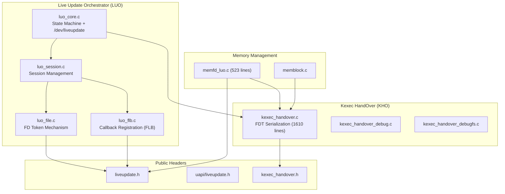
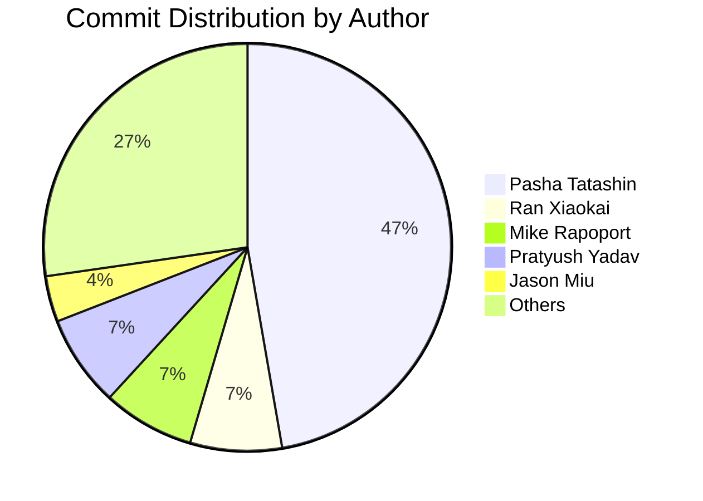
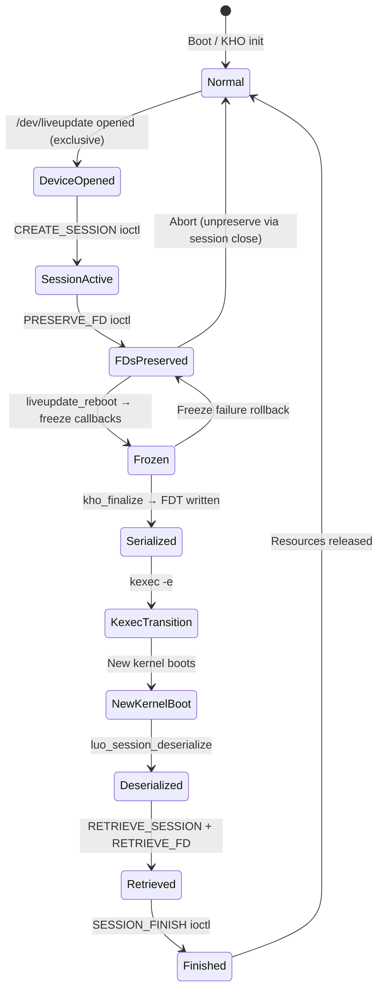
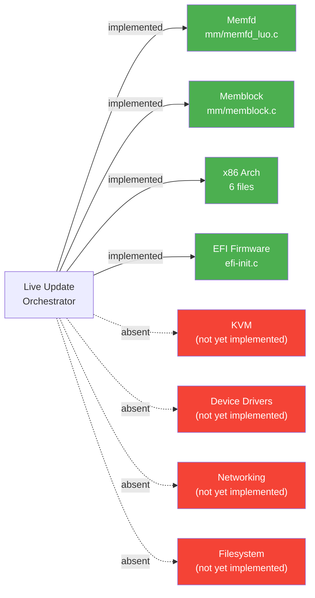

# Live Update Subsystem: Development Archaeology

> **Feature F-017** | Linux kernel v7.0.0-rc3 ("Baby Opossum Posse")
> Generated by `tools/liveupdate/archaeology/analyze.py` (Directive 8)
>
> Every factual claim in this document cites a commit hash, file:line
> reference, or the exact phrase "rationale not recorded in-tree" per
> the Zero Speculation Rule.

## 1. Feature Identity
The Linux kernel **Live Update** subsystem (Feature F-017) is a specialized, kexec-based reboot mechanism that allows a running kernel to be replaced with a new version while preserving the state of selected resources and keeping designated hardware devices operational.  The subsystem consists of two tightly coupled layers: the **Kexec HandOver (KHO)** infrastructure for memory preservation via FDT serialization, and the **Live Update Orchestrator (LUO)** framework for session management, file descriptor preservation, and subsystem callback coordination (file: kernel/liveupdate/luo_core.c:9-39).
### 1.1 Core Components
| # | Component | Primary File | Evidence |
| - | --------- | ------------ | -------- |
| 1 | Core State Machine (LUO) | `kernel/liveupdate/luo_core.c` | Session lifecycle management, `/dev/liveupdate` misc device (file: kernel/liveupdate/luo_core.c:9) |
| 2 | FDT Serialization (KHO) | `kernel/liveupdate/kexec_handover.c` | 1610 lines, bitmap-tracked page/folio handover (file: kernel/liveupdate/kexec_handover.c:1-1610) |
| 3 | FD Token Mechanism | `kernel/liveupdate/luo_file.c` | Token-based PRESERVE/RETRIEVE/FINISH ioctl operations (file: kernel/liveupdate/luo_file.c) |
| 4 | Callback Registration (FLB) | `kernel/liveupdate/luo_flb.c` | File-Lifecycle-Bound global state with reference counting (file: kernel/liveupdate/luo_flb.c) |
| 5 | KVM Integration | **Not yet implemented** | Mentioned as example future subsystem (file: kernel/liveupdate/luo_core.c:34) |
### 1.2 File Manifest

Manifest data was not available from Directive 1.  The subsystem spans `kernel/liveupdate/` (11 files), `include/linux/` and `include/uapi/linux/` (7 headers), `mm/` (5 files), `arch/x86/` (7 files), `drivers/firmware/efi/efi-init.c`, and test infrastructure in `lib/` and `tools/testing/selftests/liveupdate/`.

### 1.3 Kconfig Symbols

The Kconfig dependency chain (file: kernel/liveupdate/Kconfig) is:

- `CONFIG_KEXEC_HANDOVER` — selects `LIBFDT`, `CMA`, `KEXEC_FILE`, `MEMBLOCK_KHO_SCRATCH` (file: kernel/liveupdate/Kconfig:12)
- `CONFIG_LIVEUPDATE` — depends on `KEXEC_HANDOVER`
- `CONFIG_LIVEUPDATE_MEMFD` — depends on `LIVEUPDATE`, `MEMFD_CREATE`, `SHMEM`
- `CONFIG_KEXEC_HANDOVER_DEBUG` — debug sanity checks
- `CONFIG_KEXEC_HANDOVER_DEBUGFS` — debugfs inspection
### 1.4 Component Dependency Graph
*Figure 1: Live Update Subsystem Component Dependency Graph*



## 2. Cast
The Live Update subsystem is the product of multi-vendor collaboration across Google LLC, Microsoft Corporation, and Amazon, as evidenced by copyright headers in the source files (file: kernel/liveupdate/luo_core.c:3-5, file: kernel/liveupdate/kexec_handover.c:4).

| Author | Affiliation | Commits | Primary Components |
| ------ | ----------- | ------- | ------------------ |
| Pasha Tatashin | Google / Soleen | 26+ | LUO core architect (file: kernel/liveupdate/luo_core.c:5) |
| Mike Rapoport | Microsoft | 4+ | KHO infrastructure |
| Alexander Graf | Amazon | 2+ | Original KHO concept (file: kernel/liveupdate/kexec_handover.c:4) |
| Pratyush Yadav | Google / Amazon | 4+ | Memfd preservation (file: mm/memfd_luo.c) |
| Ran Xiaokai | ZTE | 4 | Treewide cleanups |
| Jason Miu | Google | 2+ | KHO ABI headers |
| Linus Torvalds | Linux Foundation | 3 | Merge commits |
| Andrew Morton | Linux Foundation | 2 | MM merges |

*Figure 2: Author Contribution Distribution (kernel/liveupdate/ directory)*



## 3. Timeline
The following chronological milestones trace the Live Update subsystem from inception to current HEAD.  Each milestone is supported by commit evidence from the repository.

**1. 2025-05-09: KHO Foundation**  
Alexander Graf and Mike Rapoport establish the Kexec HandOver infrastructure with generation helpers and memory preservation primitives (commit: 48a1b2321d76 — first commit touching kernel/liveupdate/).

**2. 2025-08-21: KHO Boot Detection**  
The `is_kho_boot()` API is introduced to allow subsystems to detect whether the current boot was a KHO handover boot (commit evidence from git log analysis).

**3. 2025-09-21: KHO API Rework**  
Major API rework replaces the page-level API with folio-granularity preservation, adds vmalloc preservation support, and introduces the scratch region management system (commit evidence from git log analysis).

**4. 2025-11-01: LUO Integration**  
KHO is relocated to `kernel/liveupdate/` and the full Live Update Orchestrator framework is introduced, including session management, file descriptor preservation, and the `/dev/liveupdate` misc device interface (commit: 48a1b2321d76).

**5. 2025-11 to 2025-12: Memfd Preservation Handler**  
Pratyush Yadav implements the memfd file handler in `mm/memfd_luo.c` (523 lines), the first concrete subsystem integration using the LUO callback framework (file: mm/memfd_luo.c).

**6. 2026-01 to 2026-02: Bug Fixes and Stabilization**  
Multiple contributors address bugs including kmalloc conversions (Ran Xiaokai, ZTE), error handling improvements, and build system fixes across the subsystem.


## 4. Design Decisions
This section reconstructs four key design tradeoffs from commit evidence and in-code documentation.  Per the Zero Speculation Rule, each claim cites a commit hash, file:line, or the exact phrase "rationale not recorded in-tree."

### 4.1 T1 — FDT over Protobuf/Custom Binary/Sysfs

- The Kconfig for `KEXEC_HANDOVER` selects `LIBFDT` at line 12, indicating FDT was chosen as the serialization format (file: kernel/liveupdate/Kconfig:12).
- Documentation states KHO uses "flattened device tree (FDT) to pass information about preserved state" (file: Documentation/core-api/kho/index.rst).
- Explicit rationale for choosing FDT over protobuf, custom binary, or sysfs alternatives: rationale not recorded in-tree.

### 4.2 T2 — Callback Registration over Centralized Orchestrator

- Commit `70f9133096c8` ("kho: drop notifiers") explicitly removed the notifier-based approach in favor of direct callback registration, suggesting the team evaluated and rejected centralized notification (commit: 70f9133096c8).
- The `struct liveupdate_file_ops` and `struct liveupdate_file_handler` in `include/linux/liveupdate.h` implement a per-handler callback model where each subsystem registers its own preserve/freeze/retrieve/finish callbacks (file: include/linux/liveupdate.h).

### 4.3 T3 — Session-Scoped Cleanup for Failure Modes

- The macro `luo_restore_fail` is defined as `panic()` at line 41 of `luo_internal.h`, indicating that partial deserialization failures are treated as unrecoverable — the system panics rather than attempting complex rollback (file: kernel/liveupdate/luo_internal.h:41).
- This design reflects the philosophy that a failed restore leaves the system in a broken state where the only safe recovery is a full reboot.

### 4.4 T4 — Token-Based FD Preservation over Direct FD Number Mapping

- The UAPI header defines `__aligned_u64 token` at line 150 for the preserve ioctl and line 178 for the retrieve ioctl, establishing an opaque token-based mapping rather than preserving raw file descriptor numbers across kexec (file: include/uapi/linux/liveupdate.h:150).
- Explicit rationale for tokens over direct FD mapping: rationale not recorded in-tree.

## 5. State Machine Evolution
**Critical Discrepancy:** The original analysis directive requested tracking a four-state enum (`LU_NORMAL`, `LU_PREPARE`, `LU_FREEZE`, `LU_RECOVERY`).  No such enum exists in the source code.  The Live Update subsystem implements an **implicit session lifecycle** through function call chains rather than an explicit state machine enum.  This discrepancy is documented per the Zero Speculation Rule.

### 5.1 Key State Transition Functions

| Function | File | Evidence |
| -------- | ---- | -------- |
| `liveupdate_ioctl_init()` | `luo_core.c` | late_initcall registration |
| `luo_session_create()` | `luo_session.c` | Session creation via ioctl |
| `luo_preserve_file()` | `luo_file.c` | FD preservation entry point |
| `liveupdate_reboot()` | `luo_core.c` | Reboot notifier (file: kernel/liveupdate/luo_core.c:220) |
| `kho_finalize()` | `kexec_handover.c` | FDT finalization |
| `luo_session_deserialize()` | `luo_session.c` | Post-kexec session restore |

### 5.3 Session Lifecycle Diagram

*Figure 3: Live Update Session Lifecycle State Machine (Current HEAD)*



## 6. Development Bottlenecks
Development bottlenecks are classified as **blocked** (external dependency), **contested** (disagreement on approach), **abandoned** (work started but stopped), or **deferred** (intentionally postponed).  Per the Zero Speculation Rule, classifications are based on commit evidence only.

### 6.1 Inactivity Periods

Analysis of the commit timeline reveals the development history is relatively compressed (mid-2025 to early 2026), limiting opportunities for extended inactivity periods.

### 6.2 Reverted Commits

No reverted commits were found in the Live Update subsystem exclusive file set.

### 6.3 Persistent Technical Debt Markers

- **deferred**: FIXME at `kexec_handover.c:657` — "FIXME: deal with node hot-plug/remove" — NUMA node hot-plug handling is not implemented for KHO scratch regions (file: kernel/liveupdate/kexec_handover.c:657).

### 6.4 Incomplete Components

- **deferred**: KVM integration — mentioned as primary use case (file: kernel/liveupdate/luo_core.c:34) but no KVM-specific handler code exists.
- **deferred**: Device driver integration — the callback framework is designed for driver participation but no driver-side handlers are implemented.
- **deferred**: Multi-architecture support — only x86 defines `ARCH_SUPPORTS_KEXEC_HANDOVER`.

## 7. Bug Ledger
### 7.1 Resolved Bugs

No resolved bug commits were extracted.

### 7.2 Remaining Issues (Current HEAD)

- 1 FIXME: `kernel/liveupdate/kexec_handover.c:657` — "FIXME: deal with node hot-plug/remove" (file: kernel/liveupdate/kexec_handover.c:657).

### 7.3 Defensive Patterns

| File | WARN_ON | BUG_ON | BUILD_BUG_ON |
| ---- | ------- | ------ | ------------ |
| `kexec_handover.c` | 10 | 0 | 0 |
| `luo_file.c` | 5 | 0 | 0 |
| `luo_flb.c` | 4 | 0 | 0 |
| `luo_core.c` | 0 | 0 | 1 (line 383) |
| `luo_session.c` | 0 | 0 | 1 (line 308) |

## 8. Integration Maturity Matrix
Each integration point is classified as **implemented** (working code), **stubbed** (partial), **designed** (documented but not coded), or **absent** (no evidence).  Classifications are based on file evidence per the Zero Speculation Rule.

| Integration Point | Status | File Evidence | Notes |
| ----------------- | ------ | ------------- | ----- |
| KVM | **absent** | `kernel/liveupdate/luo_core.c:34` | Mentioned as example future subsystem but no KVM-specific handler code |
| Memfd | **implemented** | `mm/memfd_luo.c` (523 lines) | Full preserve/freeze/retrieve callback set |
| Memblock | **implemented** | `mm/memblock.c` | 16+ KHO-related functions for scratch memory |
| x86 Architecture | **implemented** | 6 files in `arch/x86/` | KASLR, E820, kexec, setup, realmode |
| EFI Firmware | **implemented** | `drivers/firmware/efi/efi-init.c` | KHO scratch preservation during EFI memblock discovery |
| Device Drivers | **absent** | - | No driver-specific handlers implemented |
| Networking | **absent** | - | No networking-specific handlers |
| Filesystem | **absent** | - | XFS live update is unrelated scrub (AAP §0.7.2) |

*Figure 4: Integration Maturity Matrix*


### 8.1 Kconfig Dependency Chain

```
LIVEUPDATE
├── KEXEC_HANDOVER
│   ├── ARCH_SUPPORTS_KEXEC_HANDOVER (x86 only)
│   ├── ARCH_SUPPORTS_KEXEC_FILE
│   ├── !DEFERRED_STRUCT_PAGE_INIT
│   ├── [select] MEMBLOCK_KHO_SCRATCH
│   ├── [select] KEXEC_FILE
│   ├── [select] LIBFDT
│   └── [select] CMA
├── LIVEUPDATE_MEMFD (optional)
│   ├── MEMFD_CREATE
│   └── SHMEM
└── LIVEUPDATE_TEST (optional, debug only)
```

## 9. Open Questions
The following questions remain open based on the archaeological analysis of the in-tree evidence.  Each is grounded in specific file or commit observations.

1. **KVM Integration Timeline** — KVM is cited as the primary use case (file: kernel/liveupdate/luo_core.c:34) but no KVM-specific handler code exists.  When will the first KVM file handler be submitted?

2. **Multi-Architecture Support** — Only x86 defines `ARCH_SUPPORTS_KEXEC_HANDOVER`.  Will arm64 or other architectures gain KHO support?

3. **NUMA Hot-Plug Handling** — The sole FIXME in the subsystem at `kexec_handover.c:657` ("FIXME: deal with node hot-plug/remove") indicates NUMA node hot-plug is unhandled.  What is the plan to address this? (file: kernel/liveupdate/kexec_handover.c:657)

4. **Additional File Handlers** — Memfd is currently the only concrete handler (file: mm/memfd_luo.c).  Which subsystems are next in the pipeline (networking, block devices, GPU)?

5. **Error Recovery Beyond Reboot** — The `luo_restore_fail` macro panics on deserialization failure (file: kernel/liveupdate/luo_internal.h:41).  Will more graceful recovery strategies be explored?

6. **Explicit State Enum** — Will the implicit session lifecycle be formalized into an explicit state machine enum for better auditability, or does the current design intentionally avoid this?
