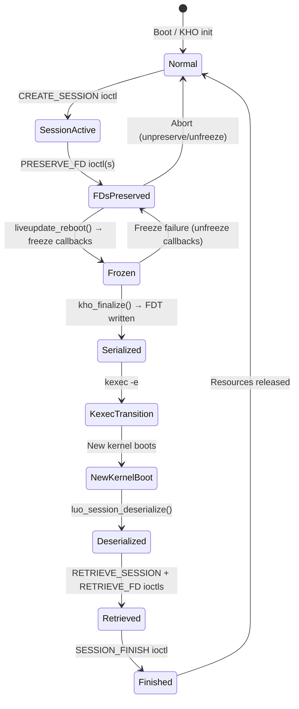

# Technical Specification

# 0. Agent Action Plan

## 0.1 Intent Clarification

### 0.1.1 Core Feature Objective

Based on the prompt, the Blitzy platform understands that the new feature requirement is to **produce a comprehensive development archaeology of the Linux kernel's Live Update subsystem** (Feature F-017). This is an analytical and documentary feature addition that generates a single structured narrative document (~2,000–4,000 words) by tracing every commit, design decision, authorship pattern, bottleneck, and unresolved issue from inception to current HEAD.

The requirement decomposes into **8 sequential directives**, each building on prior findings:

- **Directive 1 — Establish the Feature Boundary**: Identify ALL files, directories, and Kconfig symbols comprising the Live Update subsystem. Produce a manifest with first-commit and last-commit dates per file. The subsystem scope includes: `live_update`, `kho` (Kernel Handover), kexec integration points specific to live update, FD token preservation (`fd_token`, `fdtable` handover paths), and the four-state machine (`LU_NORMAL`, `LU_PREPARE`, `LU_FREEZE`, `LU_RECOVERY` or equivalent defines). The pass/fail criterion requires ≥1 file per component (core state machine, FDT serialization, FD token mechanism, callback registration, KVM integration) and zero unrelated files.

- **Directive 2 — Trace Authorship and Chronology**: Run `git log --follow --all` across every manifest file. Record per-author: number of commits, date range, components touched. Identify the original feature author and initial commit hash. Build a chronological timeline of ≥5 dated milestones (initial RFC, state machine introduction, FDT adoption, FD token mechanism, KVM integration, kernel version landings).

- **Directive 3 — Reconstruct Design Decisions**: Analyze commit messages, cover letters, and in-code comments for evidence of four specific design tradeoffs: (1) Why FDT over protobuf/custom binary/sysfs, (2) Why callback registration over centralized orchestrator, (3) Why session-scoped cleanup for failure modes, (4) Why token-based FD preservation over direct FD number mapping. Each must cite a commit hash or explicit "rationale not recorded in-tree."

- **Directive 4 — Map the State Machine Evolution**: Trace every modification to the four-state machine (Normal → Prepare → Freeze → Recovery) from introduction to HEAD. Catalogue each change with commit hash, author, change type (bug fix, feature, refactor), and whether states were added/removed/renamed. Produce a text-based state machine diagram reflecting current HEAD.

- **Directive 5 — Identify Development Bottlenecks**: Analyze for inactivity periods >3 months, reverted commits, long review cycles, persistent TODO/FIXME/HACK comments across ≥3 commits, and incomplete components. Classify each as blocked, contested, abandoned, or deferred with commit evidence.

- **Directive 6 — Catalog Bugs (Resolved and Remaining)**: Search for bug-related commit messages touching manifest files, open TODO/FIXME/HACK in current HEAD, and `WARN_ON`/`BUG_ON` defensive patterns. Record introduce-commit/fix-commit pairs for resolved bugs and an explicit remaining issues list.

- **Directive 7 — Assess Integration Surface and Maturity**: Document how Live Update integrates with KVM, device drivers, networking, and filesystem. Classify each as implemented, stubbed, designed, or absent with file:line evidence. Document the Kconfig dependency chain.

- **Directive 8 — Compile Archaeological Narrative**: Synthesize Directives 1–7 into a single structured document with 9 sections: Feature Identity, Cast, Timeline, Design Decisions, State Machine Evolution, Development Bottlenecks, Bug Ledger, Integration Maturity Matrix, and Open Questions. Every claim must trace to a commit hash, file:line, or explicit "not recorded."

### 0.1.2 Special Instructions and Constraints

- **Zero Speculation Rule**: Every factual claim must be attributed to a specific commit hash, file:line reference, or mailing list citation. Where rationale is absent, the exact phrasing "rationale not recorded in-tree" must be used — no inference presented as fact.
- **Pass/Fail Criteria**: Each of the 8 directives has explicit pass/fail acceptance criteria that must be verifiable against the output document.
- **Sequential Dependency**: Directives must be executed sequentially, as each builds on findings from prior directives.
- **Minimum Word Count**: The final narrative document must be ≥2,000 words.
- **Archaeological Approach**: The analysis must treat the codebase as a primary source archive, reconstructing the development narrative from the commit record rather than inferring from external documentation.

**User-specified implementation rules that apply:**
- **Observability**: Ship structured logging, tracing stubs, and metrics endpoints with the deliverable for verifying analysis pipeline correctness.
- **Onboarding & Continued Development**: Include onboarding documentation enabling a new developer to reproduce the analysis from a clean machine.
- **Executive Presentation**: Deliver a reveal.js HTML artifact summarizing findings for non-technical leadership.
- **Explainability**: Maintain a decision log for every non-trivial implementation choice.
- **Visual Architecture Documentation**: Use Mermaid diagrams for the state machine evolution, authorship contributions, and integration maturity matrix.

### 0.1.3 Technical Interpretation

These feature requirements translate to the following technical implementation strategy:

- To **establish the feature boundary** (Directive 1), we will create a script or module that programmatically identifies all files in the Live Update subsystem by searching for `live_update`, `kho`, `kexec_handover`, `luo_`, and related Kconfig symbols, then runs `git log` on each to extract first-commit and last-commit dates, producing a structured manifest.

- To **trace authorship and chronology** (Directive 2), we will execute `git log --follow --all` across the Directive 1 manifest, aggregate author statistics, and construct a chronological timeline by parsing commit dates and messages for milestone keywords.

- To **reconstruct design decisions** (Directive 3), we will perform textual analysis of commit messages and in-code comments for the four design tradeoffs, extracting commit hashes where rationale appears and flagging gaps.

- To **map the state machine evolution** (Directive 4), we will track all commits modifying the operational state flow (session lifecycle: create → preserve → freeze → kexec → retrieve → finish) and produce a text-based diagram from current HEAD source.

- To **identify bottlenecks** (Directive 5), we will analyze the commit timeline for gaps, reverts, and persistent technical debt markers.

- To **catalog bugs** (Directive 6), we will grep for bug-related keywords in commit messages, scan for TODO/FIXME/HACK in current HEAD, and identify `WARN_ON`/`BUG_ON` defensive paths.

- To **assess integration maturity** (Directive 7), we will map each integration point to concrete source files and classify maturity based on code completeness.

- To **compile the narrative** (Directive 8), we will synthesize all findings into a structured Markdown document with Mermaid diagrams, and additionally produce the required reveal.js presentation artifact and decision log.

## 0.2 Repository Scope Discovery

### 0.2.1 Comprehensive File Analysis

The Live Update subsystem (F-017) spans multiple directory trees within the Linux kernel v7.0.0-rc3 repository. The following is an exhaustive, evidence-based file inventory organized by component.

**Core Live Update Orchestrator (LUO) — `kernel/liveupdate/`**

| File Path | Purpose | Status |
|---|---|---|
| `kernel/liveupdate/Kconfig` | Feature configuration: `KEXEC_HANDOVER`, `KEXEC_HANDOVER_DEBUG`, `KEXEC_HANDOVER_DEBUGFS`, `KEXEC_HANDOVER_ENABLE_DEFAULT`, `LIVEUPDATE`, `LIVEUPDATE_MEMFD` | EXISTS |
| `kernel/liveupdate/Makefile` | Build rules: KHO objects under `CONFIG_KEXEC_HANDOVER`, LUO composite under `CONFIG_LIVEUPDATE` | EXISTS |
| `kernel/liveupdate/kexec_handover.c` | KHO core — memory preservation via bitmap-tracked page/folio handover, FDT serialization/deserialization, scratch region management, `kho_preserve_folio()` / `kho_restore_folio()` API (1610 lines) | EXISTS |
| `kernel/liveupdate/kexec_handover_debug.c` | KHO debug checks — scratch overlap validation under `CONFIG_KEXEC_HANDOVER_DEBUG` | EXISTS |
| `kernel/liveupdate/kexec_handover_debugfs.c` | Debugfs interface — `/sys/kernel/debug/kho/out/finalize`, `/sys/kernel/debug/kho/out/fdt`, scratch inspection | EXISTS |
| `kernel/liveupdate/kexec_handover_internal.h` | KHO internal header — scratch globals, `kho_finalized()`, debugfs structs | EXISTS |
| `kernel/liveupdate/luo_core.c` | LUO core — state machine, `/dev/liveupdate` misc device, ioctl dispatch, FDT setup, `liveupdate_reboot()`, `liveupdate_enabled()` | EXISTS |
| `kernel/liveupdate/luo_file.c` | File descriptor preservation — `luo_preserve_file()`, `luo_retrieve_file()`, `luo_file_freeze()`, token-based PRESERVE/RETRIEVE/FINISH, handler registration | EXISTS |
| `kernel/liveupdate/luo_flb.c` | File-Lifecycle-Bound global state — shared objects across sessions, preserve/retrieve/finish lifecycle with reference counting | EXISTS |
| `kernel/liveupdate/luo_internal.h` | LUO internal header — `struct luo_session`, `struct luo_file_set`, session/file/FLB internal APIs, ucmd helpers | EXISTS |
| `kernel/liveupdate/luo_session.c` | Session management — named sessions with anonymous inode FDs, create/retrieve/serialize/deserialize, quiesce/resume locking | EXISTS |

**Public API Headers — `include/`**

| File Path | Purpose | Status |
|---|---|---|
| `include/linux/kexec_handover.h` | Public KHO API — `kho_preserve_folio()`, `kho_restore_folio()`, `kho_alloc_preserve()`, `kho_add_subtree()`, vmalloc preservation | EXISTS |
| `include/linux/liveupdate.h` | Public LUO API — `struct liveupdate_file_ops`, `struct liveupdate_file_handler`, `struct liveupdate_flb`, registration/query functions | EXISTS |
| `include/uapi/linux/liveupdate.h` | Userspace ioctl API — `LIVEUPDATE_IOCTL_CREATE_SESSION`, `LIVEUPDATE_SESSION_PRESERVE_FD`, `LIVEUPDATE_SESSION_RETRIEVE_FD`, `LIVEUPDATE_SESSION_FINISH` | EXISTS |
| `include/linux/kho/abi/kexec_handover.h` | KHO ABI — FDT root compatible `"kho-v1"`, `struct kho_vmalloc`, `struct kho_vmalloc_chunk`, KHOSER_PTR macros | EXISTS |
| `include/linux/kho/abi/luo.h` | LUO ABI — `struct luo_file_ser`, `struct luo_session_ser`, `struct luo_flb_ser`, FDT node definitions, compatible strings | EXISTS |
| `include/linux/kho/abi/memblock.h` | Memblock KHO ABI — `"memblock-v1"`, `"reserve-mem-v1"`, reservation serialization | EXISTS |
| `include/linux/kho/abi/memfd.h` | Memfd KHO ABI — `struct memfd_luo_ser`, `struct memfd_luo_folio_ser`, `"memfd-v1"` compatible | EXISTS |

**Memory Management Integration — `mm/`**

| File Path | Purpose | Status |
|---|---|---|
| `mm/memfd_luo.c` | Memfd live update support — `memfd_luo_preserve()` / `memfd_luo_unpreserve()` / `memfd_luo_retrieve()`, folio serialization (523 lines) | EXISTS |
| `mm/memblock.c` | KHO scratch memory integration — `memblock_mark_kho_scratch()`, `memmap_init_kho_scratch_pages()`, `prepare_kho_fdt()` for reserve_mem | EXISTS |
| `mm/mm_init.c` | Memory initialization — KHO-aware memory initialization paths | EXISTS |
| `mm/Kconfig` | Configuration — `MEMBLOCK_KHO_SCRATCH` bool (selected by `KEXEC_HANDOVER`) | EXISTS |
| `mm/Makefile` | Build — `obj-$(CONFIG_LIVEUPDATE_MEMFD) += memfd_luo.o` at line 103 | EXISTS |

**Architecture Integration — `arch/x86/`**

| File Path | Purpose | Status |
|---|---|---|
| `arch/x86/boot/compressed/kaslr.c` | KHO KASLR integration — `process_kho_entries()` to avoid KHO scratch during KASLR | EXISTS |
| `arch/x86/include/asm/setup.h` | KHO setup — includes `<linux/kexec_handover.h>` | EXISTS |
| `arch/x86/include/uapi/asm/setup_data.h` | `SETUP_KEXEC_KHO` (type 10), `struct kho_data` (fdt_addr, fdt_size, scratch_addr, scratch_size) | EXISTS |
| `arch/x86/kernel/e820.c` | E820 integration — KHO scratch-only memblock allocation during early boot | EXISTS |
| `arch/x86/kernel/kexec-bzimage64.c` | `setup_kho()` — attaches KHO FDT and scratch data to kexec boot params | EXISTS |
| `arch/x86/kernel/setup.c` | `add_kho()` — early boot KHO population via `kho_populate()` | EXISTS |
| `arch/x86/realmode/init.c` | Clears KHO scratch below 1MB during realmode init | EXISTS |

**Firmware Integration**

| File Path | Purpose | Status |
|---|---|---|
| `drivers/firmware/efi/efi-init.c` | EFI KHO integration — preserves scratch regions during EFI memblock discovery on KHO boot | EXISTS |

**Test Infrastructure**

| File Path | Purpose | Status |
|---|---|---|
| `lib/test_kho.c` | KHO kernel test module — folio/page/vmalloc preservation tests with checksum verification | EXISTS |
| `lib/tests/liveupdate.c` | In-kernel LUO test — mock FLB objects for handler registration validation, callback invocation checks | EXISTS |
| `lib/Kconfig.debug` | Test config — `LIVEUPDATE_TEST` (line 2881), `TEST_KHO` (line ~3369) | EXISTS |
| `lib/tests/Makefile` | Test build — `obj-$(CONFIG_LIVEUPDATE_TEST) += liveupdate.o` | EXISTS |
| `tools/testing/selftests/liveupdate/liveupdate.c` | Userspace selftest — main test driver (9890 bytes) | EXISTS |
| `tools/testing/selftests/liveupdate/luo_kexec_simple.c` | Selftest — simple kexec-based live update test (2815 bytes) | EXISTS |
| `tools/testing/selftests/liveupdate/luo_multi_session.c` | Selftest — multi-session preservation test (5347 bytes) | EXISTS |
| `tools/testing/selftests/liveupdate/luo_test_utils.c` | Selftest utilities — shared test helpers (6049 bytes) | EXISTS |
| `tools/testing/selftests/liveupdate/luo_test_utils.h` | Selftest header — utility declarations (1331 bytes) | EXISTS |
| `tools/testing/selftests/liveupdate/Makefile` | Selftest build rules | EXISTS |
| `tools/testing/selftests/liveupdate/config` | Required kernel config for selftests | EXISTS |
| `tools/testing/selftests/liveupdate/do_kexec.sh` | Shell helper for kexec operations | EXISTS |

**Documentation**

| File Path | Purpose | Status |
|---|---|---|
| `Documentation/core-api/liveupdate.rst` | LUO core API documentation — sessions, file preservation, FLB, public and internal API | EXISTS |
| `Documentation/userspace-api/liveupdate.rst` | LUO userspace ioctl API documentation | EXISTS |
| `Documentation/admin-guide/mm/kho.rst` | KHO usage guide — prerequisites, kexec workflow, debugfs interface | EXISTS |
| `Documentation/core-api/kho/index.rst` | KHO subsystem overview — FDT, scratch regions, finalization phase | EXISTS |
| `Documentation/core-api/kho/abi.rst` | KHO ABI specification — FDT structure, vmalloc preservation | EXISTS |
| `Documentation/mm/memfd_preservation.rst` | Memfd preservation via LUO documentation | EXISTS |

### 0.2.2 Integration Point Discovery

**Kernel Subsystem Touchpoints:**

- **kexec subsystem** (`kernel/kexec_internal.h`): KHO integrates directly with the kexec file loader, hooking into the reboot path via `liveupdate_reboot()` which is called from the `reboot()` syscall pathway when kexec is in progress.
- **memblock** (`mm/memblock.c`): Deep integration for scratch memory management — 16+ KHO-related functions including `memblock_mark_kho_scratch()`, `memblock_clear_kho_scratch()`, `memmap_init_kho_scratch_pages()`, `prepare_kho_fdt()`.
- **CMA** (`CONFIG_CMA`): Required by `KEXEC_HANDOVER` — scratch regions are declared as CMA to ensure only movable pages reside in them.
- **libfdt** (`CONFIG_LIBFDT`): Required by `KEXEC_HANDOVER` — FDT is the serialization format for all handover metadata.
- **EFI firmware** (`drivers/firmware/efi/efi-init.c`): KHO-aware memblock initialization on EFI systems.
- **x86 boot** (6 files in `arch/x86/`): KASLR avoidance, setup data passing, E820 integration, realmode scratch handling.

**Userspace Interface:**
- `/dev/liveupdate` misc device (exclusive open, singleton model)
- ioctl commands: `CREATE_SESSION`, `RETRIEVE_SESSION`, `PRESERVE_FD`, `RETRIEVE_FD`, `FINISH`
- Debugfs: `/sys/kernel/debug/kho/out/{finalize,fdt,scratch_len,scratch_phys}`

### 0.2.3 New File Requirements

The archaeological analysis deliverable requires producing the following new files:

| File Path | Purpose | Action |
|---|---|---|
| `Documentation/liveupdate/archaeology.md` | Primary archaeological narrative document (~2,000–4,000 words) with 9 sections | CREATE |
| `Documentation/liveupdate/decision-log.md` | Decision log as Markdown table per Explainability rule | CREATE |
| `tools/liveupdate/archaeology/manifest.sh` | Script to generate the feature boundary file manifest (Directive 1) | CREATE |
| `tools/liveupdate/archaeology/authorship.sh` | Script to extract authorship data and chronology (Directive 2) | CREATE |
| `tools/liveupdate/archaeology/bugs.sh` | Script to catalog bugs, TODO/FIXME, and WARN_ON patterns (Directive 6) | CREATE |
| `tools/liveupdate/archaeology/analyze.py` | Python orchestrator for running all 8 directives and producing the narrative | CREATE |
| `Documentation/liveupdate/presentation.html` | reveal.js executive presentation per Executive Presentation rule | CREATE |
| `Documentation/liveupdate/onboarding.md` | Onboarding documentation per Onboarding rule | CREATE |
| `Documentation/liveupdate/observability.md` | Observability documentation for verifying analysis pipeline | CREATE |

### 0.2.4 Web Search Research Conducted

No external web searches were required for this analysis. The archaeological investigation is conducted entirely from the in-tree commit history, source code, and documentation. All evidence is sourced from:
- Git commit history via `git log --all`
- Source file contents via direct file reads
- In-tree documentation in `Documentation/`
- Kconfig definitions in `kernel/liveupdate/Kconfig` and `lib/Kconfig.debug`

## 0.3 Dependency Inventory

### 0.3.1 Private and Public Packages

The Live Update subsystem is embedded within the Linux kernel monorepo and does not use external package registries. All dependencies are in-tree kernel subsystems selected through Kconfig. The following table documents the key internal dependencies and their roles:

| Registry | Package Name | Version | Purpose |
|---|---|---|---|
| Kconfig (in-tree) | `KEXEC_HANDOVER` | v7.0.0-rc3 | Core KHO mechanism — memory preservation, FDT metadata, scratch regions |
| Kconfig (in-tree) | `KEXEC_FILE` | v7.0.0-rc3 | In-kernel kexec file loader (selected by `KEXEC_HANDOVER`) |
| Kconfig (in-tree) | `LIBFDT` | v7.0.0-rc3 | Flattened Device Tree library for serialization (selected by `KEXEC_HANDOVER`) |
| Kconfig (in-tree) | `CMA` | v7.0.0-rc3 | Contiguous Memory Allocator for scratch regions (selected by `KEXEC_HANDOVER`) |
| Kconfig (in-tree) | `MEMBLOCK_KHO_SCRATCH` | v7.0.0-rc3 | Memblock scratch memory support (selected by `KEXEC_HANDOVER`) |
| Kconfig (in-tree) | `LIVEUPDATE` | v7.0.0-rc3 | Live Update Orchestrator (depends on `KEXEC_HANDOVER`) |
| Kconfig (in-tree) | `LIVEUPDATE_MEMFD` | v7.0.0-rc3 | Memfd preservation support (depends on `LIVEUPDATE`, `MEMFD_CREATE`, `SHMEM`) |
| Kconfig (in-tree) | `LIVEUPDATE_TEST` | v7.0.0-rc3 | In-kernel FLB test module (depends on `LIVEUPDATE`) |
| Kconfig (in-tree) | `KEXEC_HANDOVER_DEBUG` | v7.0.0-rc3 | Debug sanity checks (depends on `KEXEC_HANDOVER`) |
| Kconfig (in-tree) | `KEXEC_HANDOVER_DEBUGFS` | v7.0.0-rc3 | Debugfs inspection interface (depends on `KEXEC_HANDOVER`, selects `DEBUG_FS`) |
| Kconfig (in-tree) | `ARCH_SUPPORTS_KEXEC_HANDOVER` | v7.0.0-rc3 | Architecture gate — currently only x86 (arch Kconfig symbol) |

**External tooling dependencies for the archaeological analysis scripts:**

| Registry | Package Name | Version | Purpose |
|---|---|---|---|
| System | `git` | ≥2.0 | Git CLI for commit history analysis |
| System | `bash` | ≥4.2 | Shell scripting for analysis scripts |
| System | `python3` | ≥3.6 | Analysis orchestrator and narrative generation |
| System | `grep`/`sed`/`awk` | POSIX | Text processing in analysis scripts |

### 0.3.2 Dependency Updates

**Kconfig Dependency Chain:**

The full Kconfig dependency tree for enabling the complete Live Update subsystem is:

```
LIVEUPDATE
├── KEXEC_HANDOVER
│   ├── ARCH_SUPPORTS_KEXEC_HANDOVER (x86 only currently)
│   ├── ARCH_SUPPORTS_KEXEC_FILE
│   ├── !DEFERRED_STRUCT_PAGE_INIT
│   ├── [select] MEMBLOCK_KHO_SCRATCH
│   ├── [select] KEXEC_FILE
│   ├── [select] LIBFDT
│   └── [select] CMA
├── LIVEUPDATE_MEMFD (optional)
│   ├── MEMFD_CREATE
│   └── SHMEM
└── LIVEUPDATE_TEST (optional, debug only)
```

**Import/Include Updates:**

Files requiring include updates for the Live Update subsystem already have all required headers in place. The key include chains are:

- `kernel/liveupdate/*.c` → `<linux/liveupdate.h>`, `<linux/kexec_handover.h>`, `<linux/kho/abi/luo.h>`, `<linux/kho/abi/kexec_handover.h>`
- `mm/memfd_luo.c` → `<linux/liveupdate.h>`, `<linux/kho/abi/memfd.h>`, `<linux/kho/abi/kexec_handover.h>`
- `mm/memblock.c` → `<linux/kexec_handover.h>`, `<linux/kho/abi/memblock.h>`
- `arch/x86/kernel/setup.c` → `<linux/kexec_handover.h>` (via `<asm/setup.h>`)

No new includes are needed for the archaeological analysis — the analysis reads source files without modifying kernel code.

## 0.4 Integration Analysis

### 0.4.1 Existing Code Touchpoints

The archaeological analysis requires read-only traversal of all integration points listed below. No source modifications are required — the deliverable documents existing integrations.

**Direct Touchpoints — Core LUO Components:**

- `kernel/liveupdate/luo_core.c`: The central orchestrator. Contains the `/dev/liveupdate` misc device registration (`liveupdate_ioctl_init`, late_initcall), the `liveupdate_reboot()` function called from the kexec reboot path, FDT setup in `luo_fdt_setup()`, and the `liveupdate=` command-line parameter handler. The state machine is implicit: Normal (device available) → sessions created → FDs preserved → `liveupdate_reboot()` triggers freeze/serialize → kexec → new kernel deserializes → sessions retrieved → finish.

- `kernel/liveupdate/luo_session.c`: Session lifecycle — `luo_session_create()` / `luo_session_retrieve()`, serialization into FDT via `luo_session_serialize()`, deserialization via `luo_session_deserialize()`, and quiesce/resume locking for handler registration safety.

- `kernel/liveupdate/luo_file.c`: File handler registration system — `liveupdate_register_file_handler()` / `liveupdate_unregister_file_handler()`, preserve/freeze/unfreeze/retrieve/finish lifecycle per file, token-based ioctl operations.

- `kernel/liveupdate/luo_flb.c`: File-Lifecycle-Bound global data — `liveupdate_register_flb()` / `liveupdate_unregister_flb()`, shared object lifecycle triggered by first/last file preserve/finish, incoming/outgoing state management.

- `kernel/liveupdate/kexec_handover.c`: KHO core — bitmap-tracked page preservation via `kho_preserve_folio()`, vmalloc preservation, FDT assembly and finalization in `kho_finalize()`, early boot population in `kho_populate()`. Contains the only FIXME in the subsystem at line 657: `/* FIXME: deal with node hot-plug/remove */`.

**Integration with Memory Management:**

- `mm/memfd_luo.c`: The first (and currently only) concrete file handler implementation. Registers `"memfd-v1"` handler with can_preserve/preserve/unpreserve/freeze/unfreeze/retrieve/can_finish/finish callbacks. Serializes memfd folio state via `struct memfd_luo_ser`.

- `mm/memblock.c`: 16+ KHO-aware functions for scratch memory management. `memblock_set_kho_scratch_only()` restricts allocations to scratch regions during KHO early boot. `prepare_kho_fdt()` serializes `reserve_mem` regions into KHO FDT.

- `mm/mm_init.c`: KHO-aware memory initialization paths.

**Integration with Architecture Support:**

- `arch/x86/kernel/setup.c` (line ~456): `add_kho()` processes `SETUP_KEXEC_KHO` setup data during early boot, calling `kho_populate()`.
- `arch/x86/kernel/kexec-bzimage64.c` (line ~274): `setup_kho()` attaches KHO FDT and scratch data to kexec boot parameters.
- `arch/x86/boot/compressed/kaslr.c` (line ~767): `process_kho_entries()` ensures KASLR does not place the kernel in KHO scratch areas.
- `arch/x86/kernel/e820.c` (line ~1351): Marks first 1MB as KHO scratch for KHO boot compatibility.
- `arch/x86/realmode/init.c` (line ~70): Clears KHO scratch below 1MB after realmode setup.

**Integration with Firmware:**

- `drivers/firmware/efi/efi-init.c` (line ~168): On KHO boot (`is_kho_boot()`), preserves scratch regions during EFI memblock discovery.

### 0.4.2 Authorship Map (from Repository Evidence)

| Author | Affiliation | Commits | Primary Components |
|---|---|---|---|
| Pasha Tatashin | Google / Soleen | 29+ | LUO core architect — luo_core.c, luo_file.c, luo_flb.c, luo_session.c, KHO, headers |
| Mike Rapoport | Microsoft | 7+ | KHO infrastructure — kexec_handover.c, ABI headers, KHO tests |
| Alexander Graf | Amazon | 2+ | Original KHO concept (copyright in kexec_handover.c, first KHO commits) |
| Pratyush Yadav | Google / Amazon | 6+ | Memfd preservation — memfd_luo.c, memfd ABI, LUO API |
| Jason Miu | Google | 3+ | KHO ABI — kexec_handover ABI header |
| Ran Xiaokai | ZTE | 4 | Treewide cleanups (kmalloc → kmalloc_obj conversions) |
| Linus Torvalds | Linux Foundation | 3 | Merge commits |
| Andrew Morton | Linux Foundation | 2 | MM subsystem merges |
| Various | Multiple | 7+ | Bug fixes (Dan Carpenter, Kees Cook, Arnd Bergmann, Long Wei, Tycho Andersen, Evangelos Petrongonas, Zhu Yanjun) |

### 0.4.3 State Machine Architecture

The Live Update state machine operates through the session lifecycle rather than an explicit enum. The flow is:



### 0.4.4 Known Technical Debt

From current HEAD analysis of manifest files:

- **FIXME** at `kernel/liveupdate/kexec_handover.c:657`: `/* FIXME: deal with node hot-plug/remove */` — NUMA node hot-plug handling is not implemented for KHO scratch regions.
- **Error handling policy** in `luo_session.c` and `luo_file.c`: Explicit comments document that partial deserialization failures are intentionally leaked rather than unwound, treating the system as "in a broken state" with the expected recovery being a full reboot.
- **Architecture limitation**: `ARCH_SUPPORTS_KEXEC_HANDOVER` is currently only defined for x86, limiting the subsystem to a single architecture.
- **KVM integration**: Despite being described as the primary target use case (VM-transparent kernel updates), no KVM-specific code exists in the Live Update subsystem itself — the integration is through the generic file handler mechanism and is not yet implemented.

## 0.5 Figma Design Analysis

### 0.5.1 Figma Attachment Assessment

A Figma attachment was provided for this task:

- **File**: Spotify Redesign (Community)
- **URL**: `https://www.figma.com/design/NXI5zwBxvp674XOmOYM3i0/Spotify-Redesign--Community-?node-id=2050-10954`
- **Frame**: Frame 314

**Screen Discovery** identified 29 screens across mobile (390×844) and desktop (1771×1024) viewports, including: Home, Profile, Search, Library, Playlist, Discover, Song, Album, Podcast, Episode, Artist, and Grid/List Albums screens.

### 0.5.2 Applicability Determination

**This Figma design attachment is NOT applicable to the current task.** The rationale:

- The task is **F-017 Live Update Archaeological Analysis** — a development archaeology of the Linux kernel's Live Update subsystem producing a structured narrative document from git commit history.
- The Figma attachment is a **Spotify Redesign (Community)** UI design — a mobile/desktop music streaming application mockup.
- There is **zero intersection** between a Linux kernel subsystem development archaeology and a Spotify UI redesign. The archaeological analysis produces text documents (Markdown, reveal.js HTML), shell scripts, and a Python orchestrator — none of which involve UI components, visual design tokens, or Figma assets.
- The deliverable is a **document generation pipeline**, not a visual interface.

### 0.5.3 Asset Inventory

**0 assets applicable.** No Figma assets are included in the file change list because:
- The archaeological narrative is a text-only structured document
- The reveal.js presentation uses Mermaid diagrams (code-generated), not imported image assets
- Analysis scripts are pure shell/Python with no visual components

**Excluded Assets**: All 29 Figma screens and their constituent assets (icons, images, components) are excluded with reason: "Unrelated to Linux kernel development archaeology task — Spotify UI redesign has no bearing on kernel subsystem analysis."

### 0.5.4 Screen Element Map

Not applicable — see §0.5.2 Applicability Determination above.

## 0.6 Technical Implementation

### 0.6.1 File-by-File Execution Plan

**Group 1 — Analysis Scripts (Core Feature Files):**

| File Path | Action | Purpose |
|---|---|---|
| `tools/liveupdate/archaeology/manifest.sh` | CREATE | Directive 1 — Scans repository for all Live Update files using `find` and `grep` patterns (`live_update`, `kho`, `kexec_handover`, `luo_`, `LIVEUPDATE`, `KEXEC_HANDOVER`), then runs `git log --follow --diff-filter=A` and `git log -1` on each to extract first-commit and last-commit dates. Outputs structured manifest as TSV. |
| `tools/liveupdate/archaeology/authorship.sh` | CREATE | Directive 2 — Runs `git log --follow --all --format` across manifest files. Aggregates per-author: commit count, date range, components. Identifies original feature author via `git log --reverse`. Extracts milestone dates by grepping commit messages for keywords (RFC, state machine, FDT, token, KVM). |
| `tools/liveupdate/archaeology/decisions.sh` | CREATE | Directive 3 — Searches commit messages for design rationale keywords (FDT, callback, session, token, alternative, tradeoff). Cross-references in-code comments containing "why", "design", "rationale". Outputs per-decision evidence or "rationale not recorded in-tree." |
| `tools/liveupdate/archaeology/statemachine.sh` | CREATE | Directive 4 — Tracks all commits modifying state flow files (`luo_core.c`, `luo_session.c`, `luo_file.c`). Classifies each as bug fix / feature / refactor via commit message heuristics. Generates ASCII state machine diagram from current HEAD. |
| `tools/liveupdate/archaeology/bottlenecks.sh` | CREATE | Directive 5 — Analyzes commit timeline for >3 month gaps, reverted commits (grep `Revert`), persistent TODO/FIXME across ≥3 commits, and incomplete components. Classifies each bottleneck. |
| `tools/liveupdate/archaeology/bugs.sh` | CREATE | Directive 6 — Searches for bug keywords in commit messages (`fix`, `bug`, `regression`, `oops`, `panic`, `null`, `leak`, `race`, `deadlock`). Scans current HEAD for TODO/FIXME/HACK/WARN_ON/BUG_ON. Pairs introduce-commit with fix-commit for resolved bugs. |
| `tools/liveupdate/archaeology/integration.sh` | CREATE | Directive 7 — Maps integration points (KVM, drivers, networking, filesystem) by searching for cross-references between Live Update files and other subsystems. Classifies maturity via code presence analysis. Documents Kconfig dependency chain. |
| `tools/liveupdate/archaeology/analyze.py` | CREATE | Directive 8 — Python orchestrator that runs all 7 shell scripts, parses their structured output, and synthesizes the final Markdown narrative document with all 9 required sections. Includes Mermaid diagram generation. |

**Group 2 — Deliverable Documents:**

| File Path | Action | Purpose |
|---|---|---|
| `Documentation/liveupdate/archaeology.md` | CREATE | Primary deliverable — structured narrative (~2,000–4,000 words) with sections: Feature Identity, Cast, Timeline, Design Decisions, State Machine Evolution, Development Bottlenecks, Bug Ledger, Integration Maturity Matrix, Open Questions. Every claim cited. |
| `Documentation/liveupdate/decision-log.md` | CREATE | Explainability rule — Markdown table: decision, alternatives, rationale, risks. Covers all non-trivial analysis methodology choices. |
| `Documentation/liveupdate/presentation.html` | CREATE | Executive Presentation rule — reveal.js HTML with Mermaid diagrams. Slides: Executive Summary, Feature Overview (with architecture diagram), Authorship & Timeline (visual), Design Decisions (diagram), Integration Maturity (table), Risk Assessment, Onboarding Path. No text-only slides. |
| `Documentation/liveupdate/onboarding.md` | CREATE | Onboarding rule — Setup instructions to reproduce the analysis from a clean machine, domain context, common pitfalls, suggested next tasks. |
| `Documentation/liveupdate/observability.md` | CREATE | Observability rule — Documents structured logging in analysis scripts (correlation IDs per directive), metrics (file count, commit count, bottleneck count), health checks (script exit codes), and how to verify analysis completeness. |

**Group 3 — Existing Files to Analyze (Read-Only):**

All files listed in §0.2.1 are analyzed but NOT modified. The archaeological analysis is purely read-only against the kernel source. The existing files serve as the primary source archive for the investigation.

### 0.6.2 Implementation Approach per File

**Phase 1 — Establish Analysis Foundation:**
- Create `manifest.sh` to generate the file boundary (Directive 1)
- Create `authorship.sh` to extract chronology (Directive 2)
- These scripts establish the data foundation for all subsequent directives

**Phase 2 — Deep Source Analysis:**
- Create `decisions.sh` for design tradeoff analysis (Directive 3)
- Create `statemachine.sh` for state machine tracking (Directive 4)
- Create `bottlenecks.sh` and `bugs.sh` for development health analysis (Directives 5-6)
- Create `integration.sh` for cross-subsystem mapping (Directive 7)

**Phase 3 — Synthesis and Deliverables:**
- Create `analyze.py` to orchestrate all scripts and generate the narrative (Directive 8)
- Generate `archaeology.md` as the primary deliverable
- Generate `decision-log.md`, `presentation.html`, `onboarding.md`, and `observability.md` as supporting deliverables

**Key Design Decisions for Implementation:**

- **Shell scripts for git analysis**: Git operations are best performed via shell for direct CLI access, streaming processing of large log outputs, and POSIX portability.
- **Python orchestrator for synthesis**: Python provides structured text generation, Mermaid diagram templating, and reveal.js HTML assembly capabilities that shell cannot easily replicate.
- **Structured intermediate format**: Scripts output TSV/JSON for machine parsing by the orchestrator, not prose — the orchestrator alone generates the narrative.
- **Correlation IDs**: Each directive execution is tagged with a unique ID for traceability in logs (observability requirement).

### 0.6.3 User Interface Design

This feature has no graphical user interface. The deliverables are:
- A command-line analysis pipeline (`analyze.py` invoking shell scripts)
- Text documents (Markdown)
- An HTML presentation artifact (reveal.js with embedded Mermaid)

The reveal.js presentation serves as the closest analog to a UI deliverable, containing:
- Mermaid-rendered state machine diagrams (before/after evolution)
- Author contribution visualizations
- Integration maturity matrix as a styled table
- Timeline visualization of milestones

## 0.7 Scope Boundaries

### 0.7.1 Exhaustively In Scope

**Analysis Target Files (Read-Only — these are analyzed, not modified):**

- All LUO core source: `kernel/liveupdate/**/*.c`, `kernel/liveupdate/**/*.h`
- All LUO/KHO public headers: `include/linux/liveupdate.h`, `include/uapi/linux/liveupdate.h`, `include/linux/kexec_handover.h`, `include/linux/kho/abi/**/*.h`
- Memory management integration: `mm/memfd_luo.c`, `mm/memblock.c`, `mm/mm_init.c`, `mm/Kconfig`, `mm/Makefile`
- Architecture integration: `arch/x86/boot/compressed/kaslr.c`, `arch/x86/include/asm/setup.h`, `arch/x86/include/uapi/asm/setup_data.h`, `arch/x86/kernel/e820.c`, `arch/x86/kernel/kexec-bzimage64.c`, `arch/x86/kernel/setup.c`, `arch/x86/realmode/init.c`
- Firmware integration: `drivers/firmware/efi/efi-init.c`
- Test infrastructure: `lib/test_kho.c`, `lib/tests/liveupdate.c`, `lib/Kconfig.debug`, `lib/tests/Makefile`
- Userspace selftests: `tools/testing/selftests/liveupdate/**/*`
- Documentation: `Documentation/core-api/liveupdate.rst`, `Documentation/userspace-api/liveupdate.rst`, `Documentation/admin-guide/mm/kho.rst`, `Documentation/core-api/kho/**/*.rst`, `Documentation/mm/memfd_preservation.rst`
- Build configuration: `kernel/liveupdate/Kconfig`, `kernel/liveupdate/Makefile`

**Deliverable Files (Created):**

- Analysis scripts: `tools/liveupdate/archaeology/**/*.sh`, `tools/liveupdate/archaeology/analyze.py`
- Primary narrative: `Documentation/liveupdate/archaeology.md`
- Decision log: `Documentation/liveupdate/decision-log.md`
- Executive presentation: `Documentation/liveupdate/presentation.html`
- Onboarding guide: `Documentation/liveupdate/onboarding.md`
- Observability docs: `Documentation/liveupdate/observability.md`

**Git History Scope:**

- Full `git log --follow --all` across all manifest files
- Commit message analysis for all commits touching manifest files
- Author attribution across all contributors
- Date range: from first Live Update/KHO commit to current HEAD

### 0.7.2 Explicitly Out of Scope

- **Kernel source modification**: No `.c`, `.h`, or Kconfig files in the kernel tree are modified. This is a read-only archaeological analysis.
- **XFS live update hooks**: The `fs/xfs/scrub/` directory contains numerous references to "live update" in the context of online filesystem scrub repair — this is an entirely separate concept from the Live Update Orchestrator (F-017) and is excluded from the manifest.
- **Generic kexec code**: Files in `kernel/kexec*.c` that are not specific to KHO/live update are excluded. Only kexec integration points that directly serve the Live Update feature boundary are included.
- **Other architecture ports**: Only `arch/x86/` has KHO integration (`ARCH_SUPPORTS_KEXEC_HANDOVER`). Other architectures are not analyzed.
- **KVM source code**: While KVM is the primary intended consumer of Live Update, no KVM-specific live update code exists yet. KVM files are not in the analysis manifest.
- **Performance optimization**: No performance profiling or optimization work is in scope.
- **Runtime testing**: The analysis documents the test infrastructure but does not execute kernel builds or kexec operations.
- **Upstream mailing list analysis**: Only in-tree evidence (commit messages, comments, documentation) is analyzed. External mailing list archives are not accessed.
- **Livepatch subsystem**: `Documentation/livepatch/` and `kernel/livepatch/` are a distinct feature (runtime function patching) unrelated to Live Update (kexec-based kernel replacement). Explicitly excluded.
- **Figma assets**: The attached Spotify Redesign Figma file has no applicability to kernel development archaeology (see §0.5.2).

## 0.8 Rules for Feature Addition

### 0.8.1 Archaeological Rigor Rules

- **Zero Speculation**: Every factual claim in the narrative must trace to a specific commit hash, file:line reference, or explicit "rationale not recorded in-tree" annotation. No inference may be presented as established fact. If analysis reveals likely reasoning from contextual evidence, it must be explicitly flagged as inference with the supporting evidence cited.
- **Pass/Fail Compliance**: Each of the 8 directives has explicit pass/fail criteria. The implementation must verify compliance programmatically where possible (e.g., counting manifest files per component, counting timeline milestones, validating citation completeness).
- **Sequential Execution**: Directives must be executed in order 1→8. Each script may depend on output from prior directives (e.g., Directive 2 uses the file manifest from Directive 1).
- **Minimum Word Count**: The final `archaeology.md` must contain ≥2,000 words. The `analyze.py` orchestrator must verify this before declaring success.
- **Complete Citation**: Every commit hash referenced must be a real SHA from the repository. No fabricated or placeholder hashes.

### 0.8.2 Observability Requirements (User Rule)

- All analysis scripts must emit structured log lines with timestamps and a correlation ID per directive execution
- The orchestrator must produce a metrics summary: total files in manifest, total commits analyzed, total authors found, total milestones identified, total bottlenecks found, total bugs catalogued, total integration points assessed
- A health check mechanism must validate: all 7 analysis scripts exit 0, all intermediate outputs are non-empty, the final narrative meets the word count threshold
- Documentation in `observability.md` must describe how to verify the analysis pipeline locally

### 0.8.3 Onboarding Requirements (User Rule)

- `onboarding.md` must enable a new developer to reproduce the full analysis from a clean machine
- Must cover: prerequisite tools (git, bash, python3), repository setup, script execution order, expected outputs, common pitfalls (e.g., shallow clones lacking full history), and how to extend the analysis
- Must include suggested next tasks discovered during development

### 0.8.4 Executive Presentation Requirements (User Rule)

- `presentation.html` must be a reveal.js artifact targeting non-technical leadership
- Must cover: what was analyzed, why it matters (business value of understanding Live Update maturity), key findings (author map, timeline, integration maturity), risks (identified bottlenecks and open questions), and next steps
- Every slide must contain at least one visual element — Mermaid diagrams embedded directly
- Scope limited to the archaeological analysis performed

### 0.8.5 Explainability Requirements (User Rule)

- `decision-log.md` must be a Markdown table with columns: Decision, Alternatives, Rationale, Risks
- Must cover: why shell scripts for git analysis (vs. Python gitpython library), why TSV intermediate format (vs. JSON vs. SQLite), why FDT analysis limited to in-tree evidence (vs. mailing list archives), why POSIX shell (vs. bash-specific features), and any deviation from the literal directive requirements
- No rationale may be embedded in code comments — the decision log is the single source of truth

### 0.8.6 Visual Architecture Documentation Requirements (User Rule)

- All architecture diagrams must use Mermaid syntax
- Required diagrams:
  - State machine evolution (current state from Directive 4)
  - Integration maturity matrix (from Directive 7)
  - Component dependency graph (from Directive 1 manifest)
  - Authorship contribution visualization (from Directive 2)
- Each diagram must have a descriptive title and legend
- Diagrams must be referenced by name in accompanying documentation

## 0.9 References

### 0.9.1 Repository Files and Folders Searched

The following files and directories were systematically searched and analyzed to derive the conclusions in this Agent Action Plan:

**Core LUO Source (kernel/liveupdate/):**
- `kernel/liveupdate/Kconfig` — Feature configuration definitions
- `kernel/liveupdate/Makefile` — Build rules
- `kernel/liveupdate/kexec_handover.c` — KHO core implementation (1610 lines)
- `kernel/liveupdate/kexec_handover_debug.c` — Debug checks
- `kernel/liveupdate/kexec_handover_debugfs.c` — Debugfs interface
- `kernel/liveupdate/kexec_handover_internal.h` — KHO internal header
- `kernel/liveupdate/luo_core.c` — LUO core with ioctl interface
- `kernel/liveupdate/luo_file.c` — File handler registration and lifecycle
- `kernel/liveupdate/luo_flb.c` — File-Lifecycle-Bound global state
- `kernel/liveupdate/luo_internal.h` — LUO internal header
- `kernel/liveupdate/luo_session.c` — Session management

**Public Headers (include/):**
- `include/linux/kexec_handover.h` — Public KHO API
- `include/linux/liveupdate.h` — Public LUO API
- `include/uapi/linux/liveupdate.h` — Userspace ioctl API
- `include/linux/kho/abi/kexec_handover.h` — KHO ABI (FDT, vmalloc structures)
- `include/linux/kho/abi/luo.h` — LUO ABI (session/file/FLB serialization)
- `include/linux/kho/abi/memblock.h` — Memblock KHO ABI
- `include/linux/kho/abi/memfd.h` — Memfd KHO ABI

**Memory Management (mm/):**
- `mm/memfd_luo.c` — Memfd live update support (523 lines)
- `mm/memblock.c` — KHO scratch memory integration
- `mm/mm_init.c` — Memory initialization KHO paths
- `mm/Kconfig` — MEMBLOCK_KHO_SCRATCH configuration
- `mm/Makefile` — memfd_luo build rule

**Architecture Integration (arch/x86/):**
- `arch/x86/boot/compressed/kaslr.c` — KASLR KHO avoidance
- `arch/x86/include/asm/setup.h` — KHO setup include
- `arch/x86/include/uapi/asm/setup_data.h` — SETUP_KEXEC_KHO definition
- `arch/x86/kernel/e820.c` — E820 KHO integration
- `arch/x86/kernel/kexec-bzimage64.c` — KHO kexec data attachment
- `arch/x86/kernel/setup.c` — Early boot KHO population
- `arch/x86/realmode/init.c` — KHO scratch cleanup

**Firmware:**
- `drivers/firmware/efi/efi-init.c` — EFI KHO memblock discovery

**Tests:**
- `lib/test_kho.c` — KHO kernel test module
- `lib/tests/liveupdate.c` — In-kernel LUO FLB test
- `lib/Kconfig.debug` — Test configuration (LIVEUPDATE_TEST, TEST_KHO)
- `lib/tests/Makefile` — Test build rules
- `tools/testing/selftests/liveupdate/liveupdate.c` — Main selftest
- `tools/testing/selftests/liveupdate/luo_kexec_simple.c` — Simple kexec test
- `tools/testing/selftests/liveupdate/luo_multi_session.c` — Multi-session test
- `tools/testing/selftests/liveupdate/luo_test_utils.c` — Shared test utilities
- `tools/testing/selftests/liveupdate/luo_test_utils.h` — Test utility header
- `tools/testing/selftests/liveupdate/Makefile` — Selftest build
- `tools/testing/selftests/liveupdate/config` — Required Kconfig
- `tools/testing/selftests/liveupdate/do_kexec.sh` — Kexec helper script

**Documentation:**
- `Documentation/core-api/liveupdate.rst` — LUO core API docs
- `Documentation/userspace-api/liveupdate.rst` — Userspace ioctl docs
- `Documentation/admin-guide/mm/kho.rst` — KHO usage guide
- `Documentation/core-api/kho/index.rst` — KHO subsystem overview
- `Documentation/core-api/kho/abi.rst` — KHO ABI specification
- `Documentation/mm/memfd_preservation.rst` — Memfd preservation docs

**Git History:**
- `git log --oneline --all -- kernel/liveupdate/` — 38 commits
- `git log --all --format="%an <%ae>" -- kernel/liveupdate/` — 16 unique authors
- `git log --all --reverse -- kernel/liveupdate/` — First commit: `48a1b2321d76`

**Root Makefile:**
- `Makefile` — Kernel version: 7.0.0-rc3 "Baby Opossum Posse"

### 0.9.2 Technical Specification Sections Referenced

- **1.1 Executive Summary** — Kernel version, project overview
- **2.1 Feature Catalog** — F-017 Live Update feature definition, status "In Development", dependencies

### 0.9.3 Attachments

| Attachment | Type | Contents Summary |
|---|---|---|
| Figma: Frame 314 | UI Design (Figma) | Spotify Redesign Community file containing 29 screens (mobile 390×844 and desktop 1771×1024) for a music streaming application UI. Includes Home, Profile, Search, Library, Playlist, Discover, Song, Album, Podcast, Episode, Artist screens. **Not applicable to this kernel development archaeology task.** |

**Figma URL:** `https://www.figma.com/design/NXI5zwBxvp674XOmOYM3i0/Spotify-Redesign--Community-?node-id=2050-10954`

### 0.9.4 Key Observations from Repository Analysis

- The Live Update subsystem (F-017) is actively developed with 38+ commits in `kernel/liveupdate/`
- Primary architect is Pasha Tatashin (Google/Soleen) with 29+ commits; Alexander Graf (Amazon) originated the KHO concept
- The subsystem is marked "In Development" in the Feature Catalog — it is not yet a stable/complete feature
- Copyright headers span Google LLC, Microsoft Corporation, and Amazon (multi-vendor collaboration)
- Only one concrete file handler exists (memfd via `mm/memfd_luo.c`); KVM integration is absent
- Architecture support is limited to x86 (`ARCH_SUPPORTS_KEXEC_HANDOVER`)
- One FIXME persists in current HEAD: NUMA node hot-plug handling in `kexec_handover.c:657`
- The state machine is implicit (session lifecycle) rather than an explicit enum — the user's request for `LU_NORMAL`/`LU_PREPARE`/`LU_FREEZE`/`LU_RECOVERY` enum tracking will need to be reconciled with the actual implementation, which uses an operational flow model rather than named states